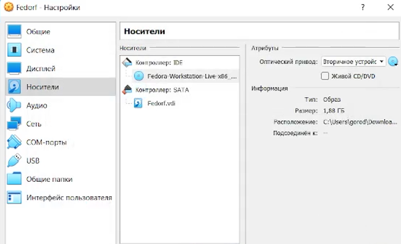
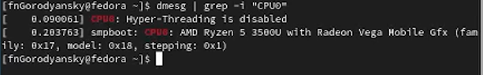

---
## Front matter
title: "Отчет по Лабораторной работе #1"
subtitle: "Установка ОС Linux"
author: "Городянский Фёдор Николаевич"

## Generic otions
lang: ru-RU
toc-title: "Содержание"

## Bibliography
bibliography: bib/cite.bib
csl: pandoc/csl/gost-r-7-0-5-2008-numeric.csl

## Pdf output format
toc: true # Table of contents
toc-depth: 2
lof: true # List of figures
lot: true # List of tables
fontsize: 12pt
linestretch: 1.5
papersize: a4
documentclass: scrreprt
## I18n polyglossia
polyglossia-lang:
  name: russian
  options:
	- spelling=modern
	- babelshorthands=true
polyglossia-otherlangs:
  name: english
## I18n babel
babel-lang: russian
babel-otherlangs: english
## Fonts
mainfont: PT Serif
romanfont: PT Serif
sansfont: PT Sans
monofont: PT Mono
mainfontoptions: Ligatures=TeX
romanfontoptions: Ligatures=TeX
sansfontoptions: Ligatures=TeX,Scale=MatchLowercase
monofontoptions: Scale=MatchLowercase,Scale=0.9
## Biblatex
biblatex: true
biblio-style: "gost-numeric"
biblatexoptions:
  - parentracker=true
  - backend=biber
  - hyperref=auto
  - language=auto
  - autolang=other*
  - citestyle=gost-numeric
## Pandoc-crossref LaTeX customization
figureTitle: "Рис."
tableTitle: "Таблица"
listingTitle: "Листинг"
lofTitle: "Список иллюстраций"
lotTitle: "Список таблиц"
lolTitle: "Листинги"
## Misc options
indent: true
header-includes:
  - \usepackage{indentfirst}
  - \usepackage{float} # keep figures where there are in the text
  - \floatplacement{figure}{H} # keep figures where there are in the text
---

# Цель работы

Целью данной работы является приобретение практических навыков установки операционной системы на виртуальную машину, настройки минимально необходимых для дальнейшей работы сервисов.

# Теоретическое введение

    Лабораторная работа подразумевает установку на виртуальную машину VirtualBox (https://www.virtualbox.org/) операционной системы Linux (дистрибутив Fedora).
    Выполнение работы возможно как в дисплейном классе факультета физико-математических и естественных наук РУДН, так и дома. Описание выполнения работы приведено для дисплейного класса со следующими характеристиками техники:
        Intel Core i3-550 3.2 GHz, 4 GB оперативной памяти, 80 GB свободного места на жёстком диске;
        ОС Linux Gentoo (http://www.gentoo.ru/);
        VirtualBox версии 7.0 или новее.
    Для установки в виртуальную машину используется дистрибутив Linux Fedora (https://getfedora.org), вариант с менеджером окон i3 (https://spins.fedoraproject.org/i3/).
    При выполнении лабораторной работы на своей технике вам необходимо скачать необходимый образ операционной системы (https://spins.fedoraproject.org/i3/download/index.html).

# Выполнение лабораторной работы

1. В виртуальной машине создали Fedora
{#fig:001 width=70%}
2. Настройки ОС.
{#fig:002 width=70%}
3. Подключение образа ОС.
{#fig:003 width=70%}
4. Запуск ОС.
{#fig:004 width=70%}
5. Настройка Fedora. Выбор языка.
{#fig:005 width=70%}
6. Загрузили систему. 
{#fig:006 width=70%}
7. Удаление образа Fedora.
{#fig:007 width=70%}
8. Перезапуск системы. Начальный экран входа.
{#fig:008 width=70%}
9. Создание аккаунта.
{#fig:009 width=70%}
10. Настройка пароля аккаунта.
{#fig:010 width=70%}
11. Выполнение домашнего задания. Вывод версии ОС Линукс.
{#fig:011 width=70%}
12. Вывод информации о процессоре.
{#fig:012 width=70%}
13. Вывод модели процессора.
{#fig:013 width=70%}
14. Вывод оперативной памяти.
{#fig:013 width=70%}
15. Вывод последовательности монтирования файловых систем.
{#fig:014 width=70%}

# Выводы

В результате работы были получены навыки работы с ОС Линукс.

# Список литературы{.unnumbered}

1.
Dash P. Getting started with oracle vm virtualbox. Packt Publishing Ltd, 2013. 86 p.
2.
Colvin H. Virtualbox: An ultimate guide book on virtualization with virtualbox. CreateSpace Independent Publishing Platform, 2015. 70 p.
3.
van Vugt S. Red hat rhcsa/rhce 7 cert guide : Red hat enterprise linux 7 (ex200 and ex300). Pearson IT Certification, 2016. 1008 p.
4.
Робачевский А., Немнюгин С., Стесик О. Операционная система unix. 2-е изд. Санкт-Петербург: БХВ-Петербург, 2010. 656 p.
5.
Немет Э. et al. Unix и Linux: руководство системного администратора. 4-е изд. Вильямс, 2014. 1312 p.
6.
Колисниченко Д.Н. Самоучитель системного администратора Linux. СПб.: БХВ-Петербург, 2011. 544 p.
7.
Robbins A. Bash pocket reference. O’Reilly Media, 2016. 156 p.

::: {#refs}
:::
