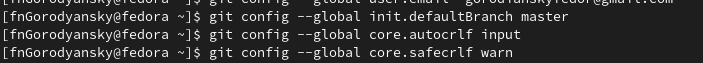

---
## Front matter
title: "Отчёт по лабораторной работе №2"
subtitle: "Первоначальная настройка git"
author: "Городянский Фёдор Николаевич"

## Generic otions
lang: ru-RU
toc-title: "Содержание"

## Bibliography
bibliography: bib/cite.bib
csl: pandoc/csl/gost-r-7-0-5-2008-numeric.csl

## Pdf output format
toc: true # Table of contents
toc-depth: 2
lof: true # List of figures
lot: true # List of tables
fontsize: 12pt
linestretch: 1.5
papersize: a4
documentclass: scrreprt
## I18n polyglossia
polyglossia-lang:
  name: russian
  options:
	- spelling=modern
	- babelshorthands=true
polyglossia-otherlangs:
  name: english
## I18n babel
babel-lang: russian
babel-otherlangs: english
## Fonts
mainfont: PT Serif
romanfont: PT Serif
sansfont: PT Sans
monofont: PT Mono
mainfontoptions: Ligatures=TeX
romanfontoptions: Ligatures=TeX
sansfontoptions: Ligatures=TeX,Scale=MatchLowercase
monofontoptions: Scale=MatchLowercase,Scale=0.9
## Biblatex
biblatex: true
biblio-style: "gost-numeric"
biblatexoptions:
  - parentracker=true
  - backend=biber
  - hyperref=auto
  - language=auto
  - autolang=other*
  - citestyle=gost-numeric
## Pandoc-crossref LaTeX customization
figureTitle: "Рис."
tableTitle: "Таблица"
listingTitle: "Листинг"
lofTitle: "Список иллюстраций"
lotTitle: "Список таблиц"
lolTitle: "Листинги"
## Misc options
indent: true
header-includes:
  - \usepackage{indentfirst}
  - \usepackage{float} # keep figures where there are in the text
  - \floatplacement{figure}{H} # keep figures where there are in the text
---

# Цель работы

  Изучить идеологию и применение средств контроля версий.
  Освоить умения по работе с git.

# Теоретическое введение

    Система контроля версий Git представляет собой набор программ командной строки. Доступ к ним можно получить из терминала посредством ввода команды git с различными опциями.
    Благодаря тому, что Git является распределённой системой контроля версий, резервную копию локального хранилища можно сделать простым копированием или архивацией.

# Выполнение лабораторной работы

1. Задали имя и email владельца репозитория.
{#fig:001 width=70%}
2. Задали имя первоначальной ветки и ввели параметры autocrl, safecrlf
{#fig:001 width=70%}
3. Создали ssh ключ размером 4096 бит.
{#fig:001 width=70%}
4. Создали ssh ключ по алгоритму ed25519:
{#fig:001 width=70%}
5. Создали pgp ключ.
{#fig:001 width=70%}
6. Скопировали ssh ключ.
{#fig:001 width=70%}
7. Скопировали pgp ключ.
{#fig:001 width=70%}
8. Настроили автоматические подписи коммитов git.
{#fig:001 width=70%}
9. Авторизировались на github.
{#fig:001 width=70%}
10. Создали репозиторий курса на сервере.
{#fig:001 width=70%}
11. Перешли в каталог курса.
{#fig:001 width=70%}
12. Подключили курс на github.
{#fig:001 width=70%}
{#fig:001 width=70%}
{#fig:001 width=70%}
13. Отправили файлы на сервер.
{#fig:001 width=70%}
14. Ssh, pgp ключи.
{#fig:001 width=70%}
15. Репозиторий курса.
{#fig:001 width=70%}

# Выводы

В результате получили навыки работы с системой git.

