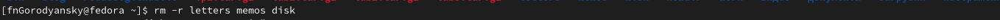

---
## Front matter
lang: ru-RU
title: Лабораторная работы №4
subtitle: Основы интерфейса взаимодействия пользователя с системой Unix на уровне командной строки
author:
  - Городянский Ф.Н.
institute:
  - Российский университет дружбы народов, Москва, Россия
date: 01 марта 2023

## i18n babel
babel-lang: russian
babel-otherlangs: english

## Formatting pdf
toc: false
toc-title: Содержание
slide_level: 2
aspectratio: 169
section-titles: true
theme: metropolis
header-includes:
 - \metroset{progressbar=frametitle,sectionpage=progressbar,numbering=fraction}
 - '\makeatletter'
 - '\beamer@ignorenonframefalse'
 - '\makeatother'
---

# Информация

## Докладчик

:::::::::::::: {.columns align=center}
::: {.column width="70%"}

  * Городянский Фёдор Николаевич
  * студент фФМиЕН
  * Российский университет дружбы народов
  * <https://github.com/Fedass>

:::
::: {.column width="30%"} 

:::
::::::::::::::

# Элементы презентации

## Цели и задачи

- Приобретение практических навыков взаимодействия пользователя с системой по-
средством командной строки.

## Материалы и методы

В операционной системе типа Linux взаимодействие пользователя с системой обычно
осуществляется с помощью командной строки посредством построчного ввода ко-
манд. При этом обычно используется командные интерпретаторы языка shell: /bin/sh;
/bin/csh; /bin/ksh.

## Содержание исследования

1. Определите полное имя вашего домашнего каталога.
{#fig:001 width=70%}
2. Перейдите в каталог /tmp
{#fig:002 width=70%}
3. Выведите на экран содержимое каталога /tmp. Для этого используйте команду ls
с различными опциями. 
{#fig:003 width=70%}
{#fig:004 width=70%}
{#fig:005 width=70%}
4. Определите, есть ли в каталоге /var/spool подкаталог с именем cron?
{#fig:006 width=70%}
5. Перейдите в Ваш домашний каталог и выведите на экран его содержимое. Опре-
делите, кто является владельцем файлов и подкаталогов?
{#fig:007 width=70%}
6. В домашнем каталоге создайте новый каталог с именем newdir
{#fig:008 width=70%}
7. В каталоге ~/newdir создайте новый каталог с именем morefun. В домашнем каталоге создайте одной командой три новых каталога с именами
letters, memos, misk. Затем удалите эти каталоги одной командой
{#fig:009 width=70%}
{#fig:010 width=70%}
8. Удалите каталог ~/newdir/morefun из домашнего каталога. Проверьте, был ли
каталог удалён.
{#fig:011 width=70%}
9. С помощью команды man определите, какую опцию команды ls нужно использо-
вать для просмотра содержимое не только указанного каталога, но и подкаталогов,
входящих в него.
{#fig:012 width=70%}
10. Используя информацию, полученную при помощи команды history, выполните мо-
дификацию и исполнение нескольких команд из буфера команд.
{#fig:013 width=70%}

## Результаты

Научился работать с пользовательским интерфейсом системы Линукс.

## Итоговый слайд

- Запоминается последняя фраза. © Штирлиц
- Главное сообщение, которое вы хотите донести до слушателей
- Избегайте использовать последний слайд вида *Спасибо за внимание*

