---
## Front matter
lang: ru-RU
title: Отчёт по лабораторной работе №5
subtitle: Анализ файловой системы Linux. Команды для работы с файлами и каталогами
author:
  - Городянский Ф.Н.
institute:
  - Российский университет дружбы народов, Москва, Россия
date: 7 марта 2023

## i18n babel
babel-lang: russian
babel-otherlangs: english

## Formatting pdf
toc: false
toc-title: Содержание
slide_level: 2
aspectratio: 169
section-titles: true
theme: metropolis
header-includes:
 - \metroset{progressbar=frametitle,sectionpage=progressbar,numbering=fraction}
 - '\makeatletter'
 - '\beamer@ignorenonframefalse'
 - '\makeatother'
---

# Информация

## Докладчик

:::::::::::::: {.columns align=center}
::: {.column width="70%"}

  * Городянский Фёдор Николаевич
  * студент фФМиЕН
  * Российский университет дружбы народов
  * <https://yamadharma.github.io/ru/>

:::
::: {.column width="30%"}

:::
::::::::::::::

# Вводная часть

# Элементы презентации

## Цели и задачи

Ознакомление с файловой системой Linux, её структурой, именами и содержанием
каталогов. Приобретение практических навыков по применению команд для работы
с файлами и каталогами, по управлению процессами (и работами), по проверке исполь-
зования диска и обслуживанию файловой системы.

1. Выполните все примеры, приведённые в первой части описания лабораторной работы.
2. Выполните следующие действия, зафиксировав в отчёте по лабораторной работе
используемые при этом команды и результаты их выполнения:
2.1. Скопируйте файл /usr/include/sys/io.h в домашний каталог и назовите его
equipment. Если файла io.h нет, то используйте любой другой файл в каталоге
/usr/include/sys/ вместо него.
2.2. В домашнем каталоге создайте директорию ~/ski.plases.
2.3. Переместите файл equipment в каталог ~/ski.plases.
2.4. Переименуйте файл ~/ski.plases/equipment в ~/ski.plases/equiplist.
2.5. Создайте в домашнем каталоге файл abc1 и скопируйте его в каталог
~/ski.plases, назовите его equiplist2.
2.6. Создайте каталог с именем equipment в каталоге ~/ski.plases.
2.7. Переместите файлы ~/ski.plases/equiplist и equiplist2 в каталог
~/ski.plases/equipment.
2.8. Создайте и переместите каталог ~/newdir в каталог ~/ski.plases и назовите
его plans.
3. Определите опции команды chmod, необходимые для того, чтобы присвоить перечис-
ленным ниже файлам выделенные права доступа, считая, что в начале таких прав
нет:
3.1. drwxr--r-- ... australia
3.2. drwx--x--x ... play
3.3. -r-xr--r-- ... my_os
3.4. -rw-rw-r-- ... feathers
При необходимости создайте нужные файлы.
4. Проделайте приведённые ниже упражнения, записывая в отчёт по лабораторной
работе используемые при этом команды:
4.1. Просмотрите содержимое файла /etc/password.
4.2. Скопируйте файл ~/feathers в файл ~/file.old.
4.3. Переместите файл ~/file.old в каталог ~/play.
4.4. Скопируйте каталог ~/play в каталог ~/fun.
4.5. Переместите каталог ~/fun в каталог ~/play и назовите его games.
4.6. Лишите владельца файла ~/feathers права на чтение.
4.7. Что произойдёт, если вы попытаетесь просмотреть файл ~/feathers командой
cat?
4.8. Что произойдёт, если вы попытаетесь скопировать файл ~/feathers?
4.9. Дайте владельцу файла ~/feathers право на чтение.
4.10. Лишите владельца каталога ~/play права на выполнение.
4.11. Перейдите в каталог ~/play. Что произошло?
4.12. Дайте владельцу каталога ~/play право на выполнение.
5. Прочитайте man по командам mount, fsck, mkfs, kill и кратко их охарактеризуйте,
приведя примеры.

## Содержание исследования

1. Выполнили все примеры, приведённые в первой части описания лабораторной работы.
{#fig:001 width=70%}
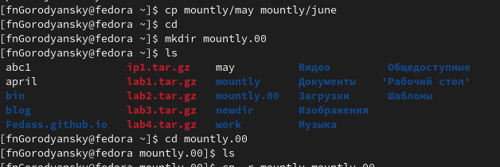{#fig:002 width=70%}
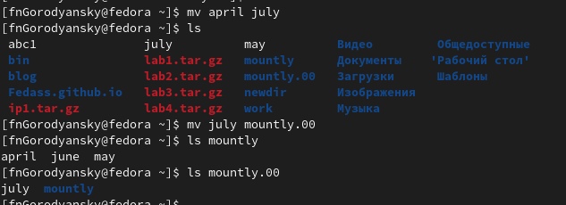{#fig:003 width=70%}
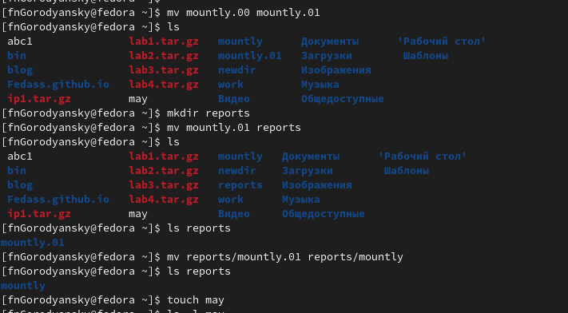{#fig:004 width=70%}
{#fig:005 width=70%}
{#fig:006 width=70%}
2. Выполните следующие действия, зафиксировав в отчёте по лабораторной работе
используемые при этом команды и результаты их выполнения: 2.1. Скопируйте файл /usr/include/sys/io.h в домашний каталог и назовите его equipment. Если файла io.h нет, то используйте любой другой файл в каталоге
/usr/include/sys/ вместо него.
{#fig:007 width=70%}
2.2-2.4. В домашнем каталоге создайте директорию ~/ski.plases.
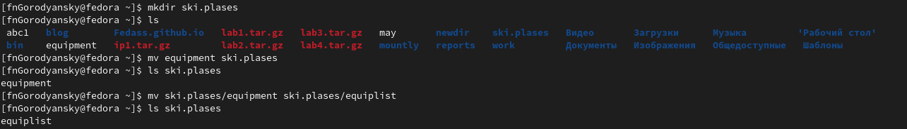{#fig:008 width=70%}
2.5. Создайте в домашнем каталоге файл abc1 и скопируйте его в каталог
~/ski.plases, назовите его equiplist2.
2.6. Создайте каталог с именем equipment в каталоге ~/ski.plases.
2.7. Переместите файлы ~/ski.plases/equiplist и equiplist2 в каталог
~/ski.plases/equipment.
{#fig:009 width=70%}
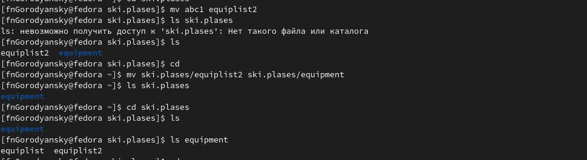{#fig:010 width=70%}
2.8. Создайте и переместите каталог ~/newdir в каталог ~/ski.plases и назовите
его plans.
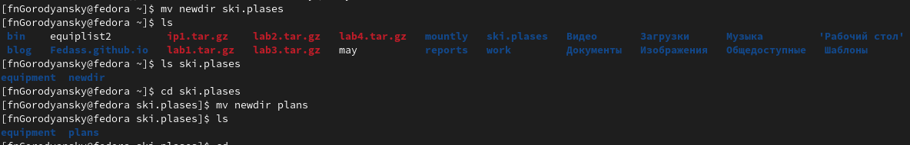{#fig:011 width=70%}
3. Определите опции команды chmod, необходимые для того, чтобы присвоить перечис-
ленным ниже файлам выделенные права доступа, считая, что в начале таких прав
нет: 3.1. drwxr--r-- ... australia. 3.2. drwx--x--x ... play. 3.3. -r-xr--r-- ... my_os. 3.4. -rw-rw-r-- ... feathers. При необходимости создайте нужные файлы
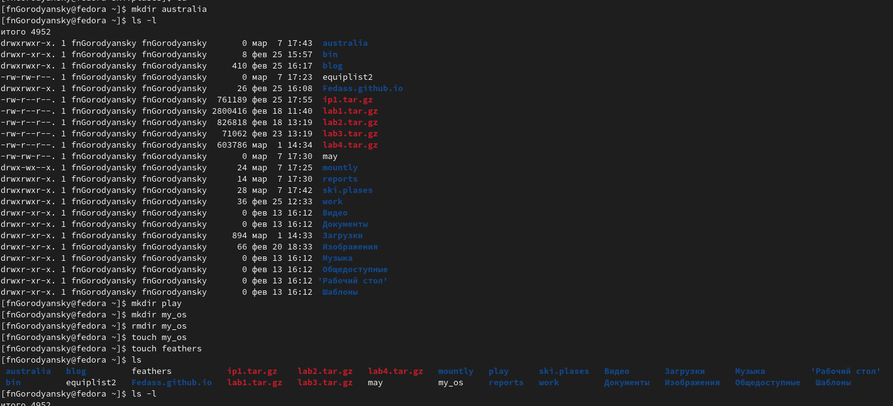{#fig:012 width=70%}
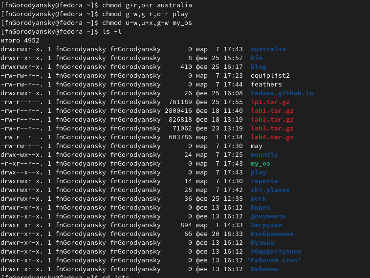{#fig:013 width=70%}
4. Проделайте приведённые ниже упражнения, записывая в отчёт по лабораторной
работе используемые при этом команды: 4.1. Просмотрите содержимое файла /etc/password.
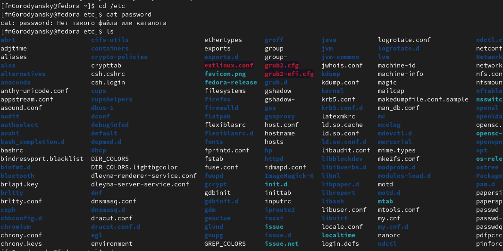{#fig:014 width=70%}
4.2. Скопируйте файл ~/feathers в файл ~/file.old. 4.3. Переместите файл ~/file.old в каталог ~/play.
4.4. Скопируйте каталог ~/play в каталог ~/fun.
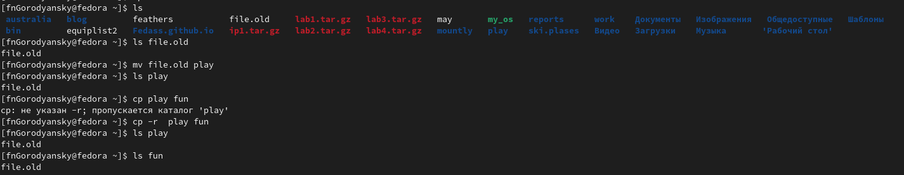{#fig:015 width=70%}
4.5. Переместите каталог ~/fun в каталог ~/play и назовите его games.
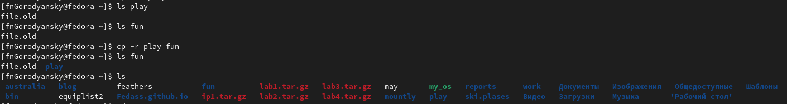{#fig:016 width=70%}
4.6.Лишите владельца файла ~/feathers права на чтение. 4.7. Что произойдёт, если вы попытаетесь просмотреть файл ~/feathers командой cat? 4.8. Что произойдёт, если вы попытаетесь скопировать файл ~/feathers? 4.9. Дайте владельцу файла ~/feathers право на чтение. 4.10. Лишите владельца каталога ~/play права на выполнение
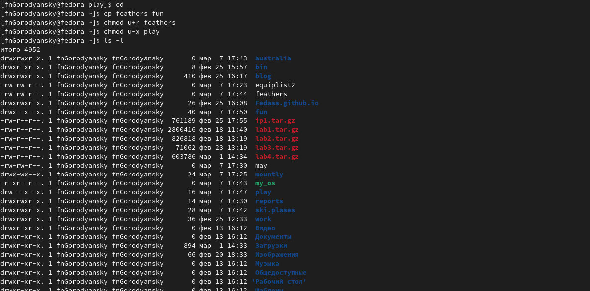{#fig:017 width=70%}
4.11. Перейдите в каталог ~/play. Что произошло? 4.12. Дайте владельцу каталога ~/play право на выполнение.
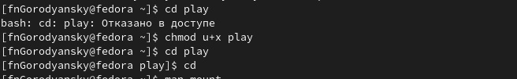{#fig:018 width=70%}
5. Прочитайте man по командам mount, fsck, mkfs, kill и кратко их охарактеризуйте,
приведя примеры.
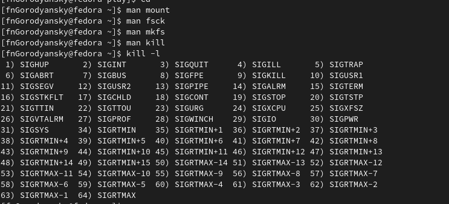{#fig:019 width=70%}

## Результаты

Получил знания для работы с файловой системой Linux и ее структурой.

