---
## Front matter
lang: ru-RU
title: Отчёт по лабораторной работе №6.
subtitle: Поиск файлов. Перенаправление ввода-вывода. Просмотр запущенных процессов.
author:
  - Городянский Ф.Н.
institute:
  - Российский университет дружбы народов, Москва, Россия
date: 13 марта 2023

## i18n babel
babel-lang: russian
babel-otherlangs: english

## Formatting pdf
toc: false
toc-title: Содержание
slide_level: 2
aspectratio: 169
section-titles: true
theme: metropolis
header-includes:
 - \metroset{progressbar=frametitle,sectionpage=progressbar,numbering=fraction}
 - '\makeatletter'
 - '\beamer@ignorenonframefalse'
 - '\makeatother'
---

# Информация

## Докладчик

:::::::::::::: {.columns align=center}
::: {.column width="70%"}

  * Городянский Фёдор Николаевич
  * студент фФМиЕН.
  * Российский университет дружбы народов
  * <https://Fedass>

:::
::: {.column width="30%"}

:::
::::::::::::::

# Элементы презентации

## Цели и задачи

Ознакомление с инструментами поиска файлов и фильтрации текстовых данных.
Приобретение практических навыков: по управлению процессами (и заданиями), по
проверке использования диска и обслуживанию файловых систем.

1. Осуществите вход в систему, используя соответствующее имя пользователя.
2. Запишите в файл file.txt названия файлов, содержащихся в каталоге /etc. Допи-
шите в этот же файл названия файлов, содержащихся в вашем домашнем каталоге.
3. Выведите имена всех файлов из file.txt, имеющих расширение .conf, после чего
запишите их в новый текстовой файл conf.txt.
4. Определите, какие файлы в вашем домашнем каталоге имеют имена, начинавшиеся
с символа c? Предложите несколько вариантов, как это сделать.
5. Выведите на экран (по странично) имена файлов из каталога /etc, начинающиеся
с символа h.
6. Запустите в фоновом режиме процесс, который будет записывать в файл ~/logfile
файлы, имена которых начинаются с log.
7. Удалите файл ~/logfile.
8. Запустите из консоли в фоновом режиме редактор gedit.
9. Определите идентификатор процесса gedit, используя команду ps, конвейер и фильтр
grep. Как ещё можно определить идентификатор процесса?
10. Прочтите справку (man) команды kill, после чего используйте её для завершения
процесса gedit.
11. Выполните команды df и du, предварительно получив более подробную информацию
об этих командах, с помощью команды man.
12. Воспользовавшись справкой команды find, выведите имена всех директорий, имею-
щихся в вашем домашнем каталоге.

## Содержание исследования

1. Осуществите вход в систему, используя соответствующее имя пользователя.
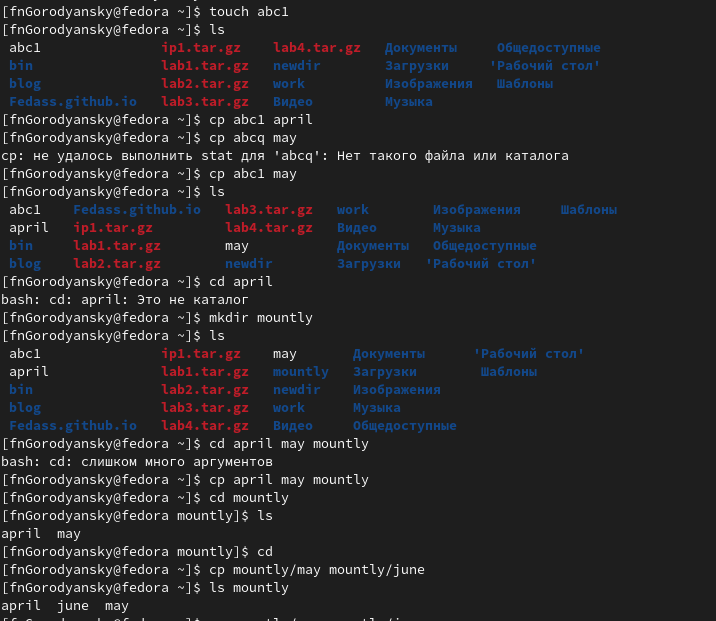{#fig:001 width=70%}
2.  Запишите в файл file.txt названия файлов, содержащихся в каталоге /etc. Допишите в этот же файл названия файлов, содержащихся в вашем домашнем каталоге.
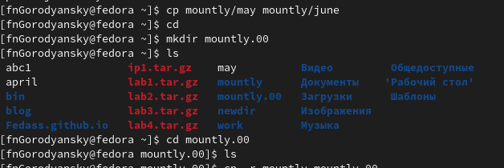{#fig:002 width=70%}
3.  Выведите имена всех файлов из file.txt, имеющих расширение .conf, после чего запишите их в новый текстовой файл conf.txt.
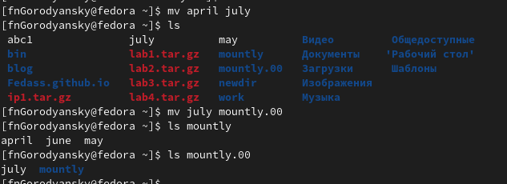{#fig:003 width=70%}
4. Определите, какие файлы в вашем домашнем каталоге имеют имена, начинавшиеся
с символа c? Предложите несколько вариантов, как это сделать.
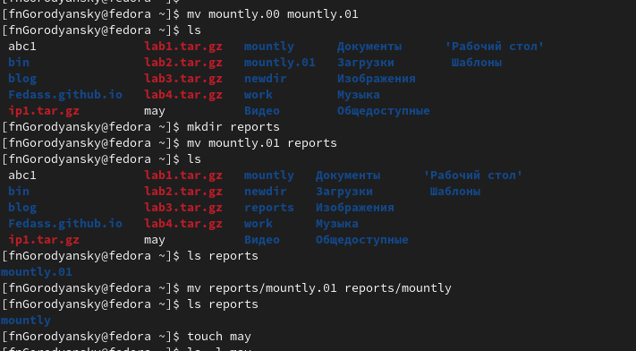{#fig:004 width=70%}
5. Выведите на экран (по странично) имена файлов из каталога /etc, начинающиеся
с символа h.
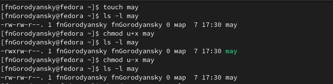{#fig:005 width=70%}
6. Запустите в фоновом режиме процесс, который будет записывать в файл ~/logfile файлы, имена которых начинаются с log.
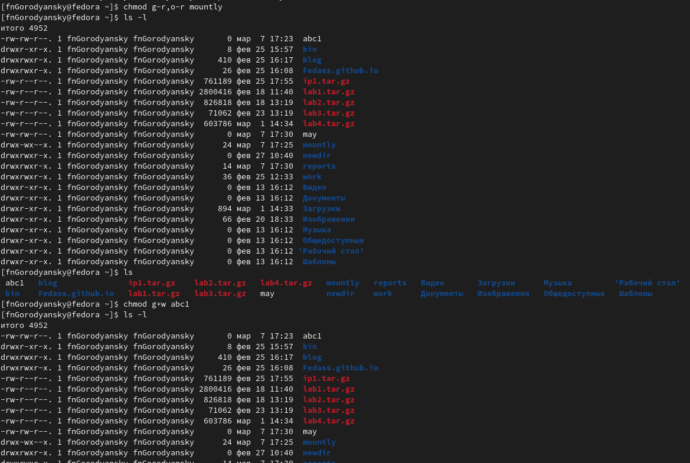{#fig:006 width=70%}
7. Удалите файл ~/logfile.
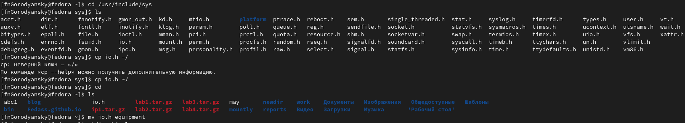{#fig:007 width=70%}
8. Запустите из консоли в фоновом режиме редактор gedit.
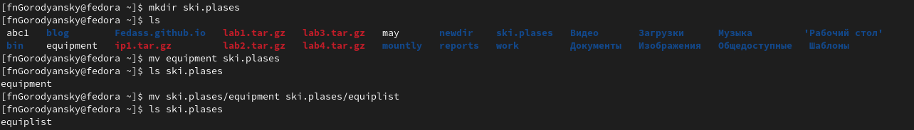{#fig:008 width=70%}
9. Определите идентификатор процесса gedit, используя команду ps, конвейер и фильтр
grep. Как ещё можно определить идентификатор процесса?
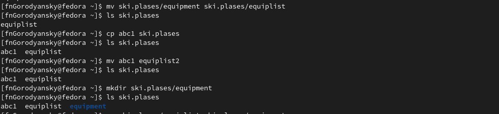{#fig:009 width=70%}
10. Прочтите справку (man) команды kill, после чего используйте её для завершения
процесса gedit.
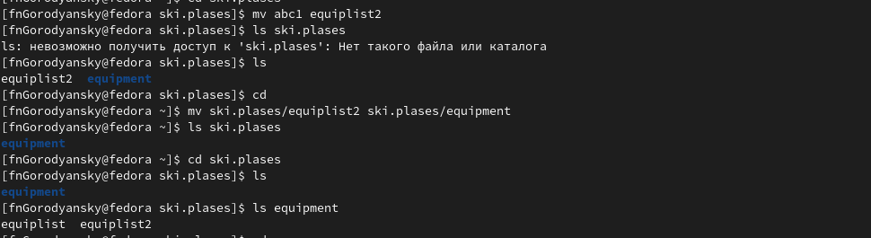{#fig:010 width=70%}
11. Выполните команды df и du, предварительно получив более подробную информацию
об этих командах, с помощью команды man.
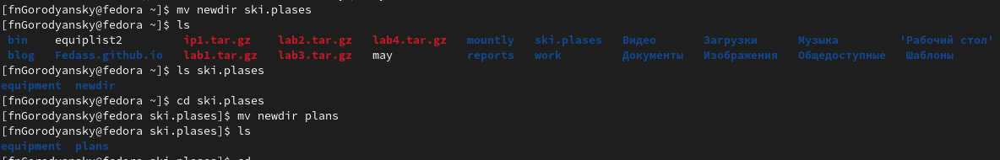{#fig:011 width=70%}
12. Воспользовавшись справкой команды find, выведите имена всех директорий, имею-
щихся в вашем домашнем каталоге.
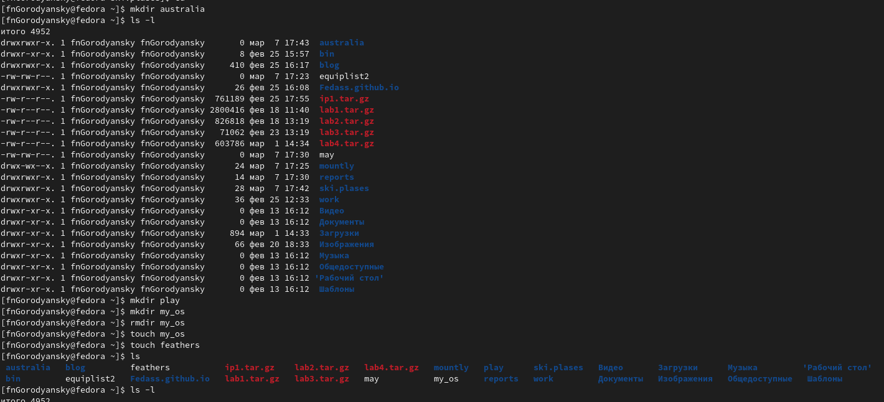{#fig:012 width=70%}

## Результаты

Ознакомился с инструментами поиска файлов и фильтрации текстовых данных.

