---
## Front matter
lang: ru-RU
title: Отчет по лабораторной работе №7
subtitle: Командная оболочка Midnight Commander
author:
  - Городянский Ф.Н.
institute:
  - Российский университет дружбы народов, Москва, Россия
date: 24 марта 2023

## i18n babel
babel-lang: russian
babel-otherlangs: english

## Formatting pdf
toc: false
toc-title: Содержание
slide_level: 2
aspectratio: 169
section-titles: true
theme: metropolis
header-includes:
 - \metroset{progressbar=frametitle,sectionpage=progressbar,numbering=fraction}
 - '\makeatletter'
 - '\beamer@ignorenonframefalse'
 - '\makeatother'
---

# Информация

## Докладчик

:::::::::::::: {.columns align=center}
::: {.column width="70%"}

  * Городянский Фёдор Николаевич
  * студент фФМиЕН.
  * Российский университет дружбы народов
  * <https://github.com/Fedass>

:::
::: {.column width="30%"}

:::
::::::::::::::

# Элементы презентации

## Цель

Освоение основных возможностей командной оболочки Midnight Commander. Приоб-
ретение навыков практической работы по просмотру каталогов и файлов; манипуляций
с ними.

# Выполнение работы.

## 1. Изучил информацию о mc, вызвав в командной строке man mc.
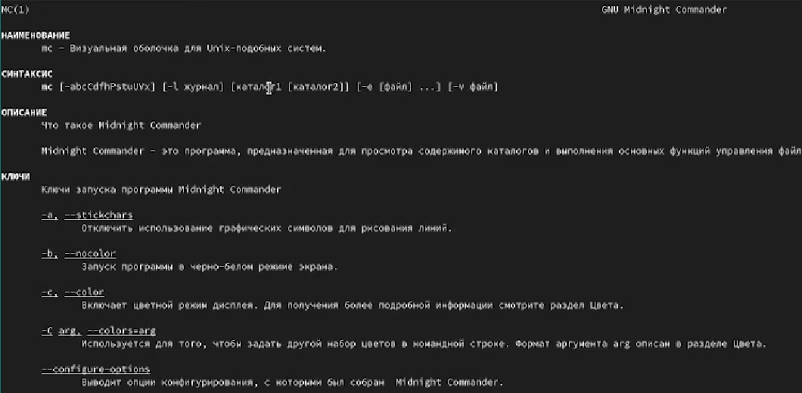{#fig:001 width=70%}
 
## 2. Запустил из командной строки mc, изучил его структуру и меню.
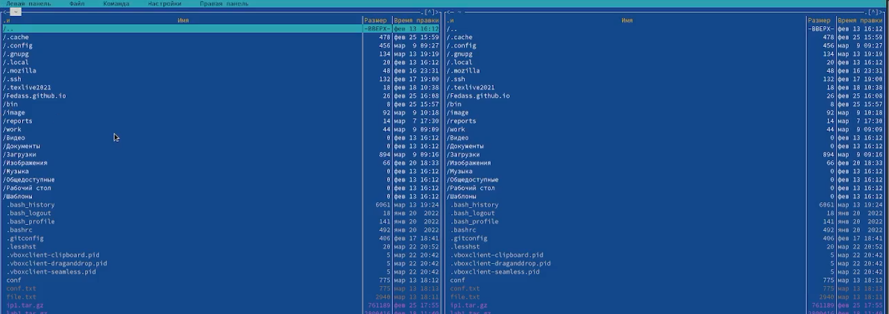{#fig:002 width=70%}

## 3. Выполнил несколько операций в mc
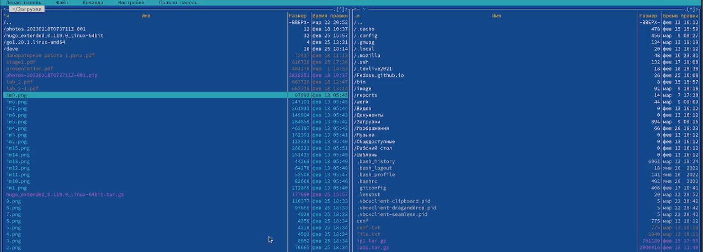{#fig:003 width=70%}

## 4. Выполнил основные команды меню левой (или правой) панели. 
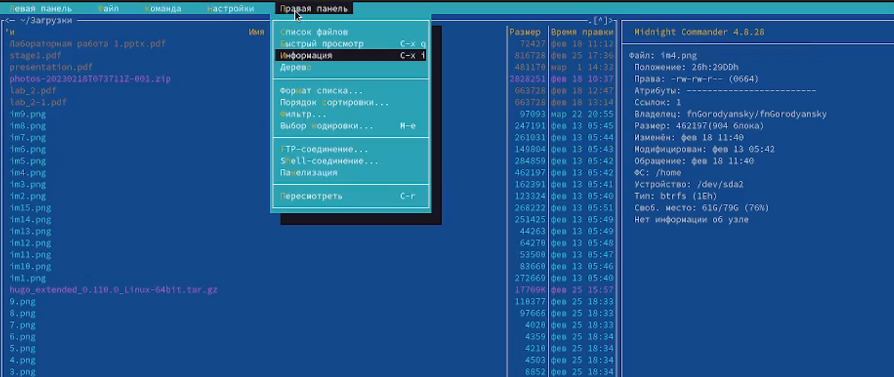{#fig:004 width=70%}

##5. Используя возможности подменю Файл , выполнил: – просмотр содержимого текстового файла; – редактирование содержимого текстового файла (без сохранения результатов редактирования); – создание каталога; – копирование в файлов в созданный каталог.
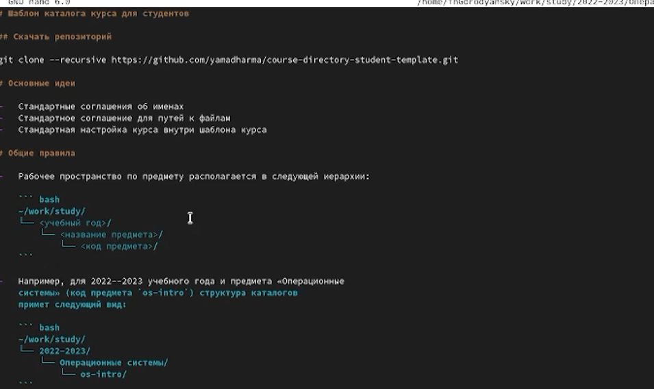{#fig:005 width=70%}

## 6. С помощью соответствующих средств подменю Команда осуществил: – поиск в файловой системе файла с заданными условиями (например, файла с расширением .c или .cpp, содержащего строку main); – выбор и повторение одной из предыдущих команд; – переход в домашний каталог;– анализ файла меню и файла расширений.

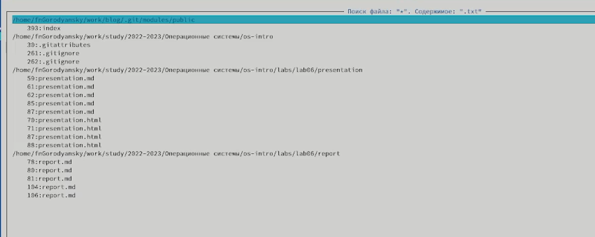{#fig:006 width=70%}
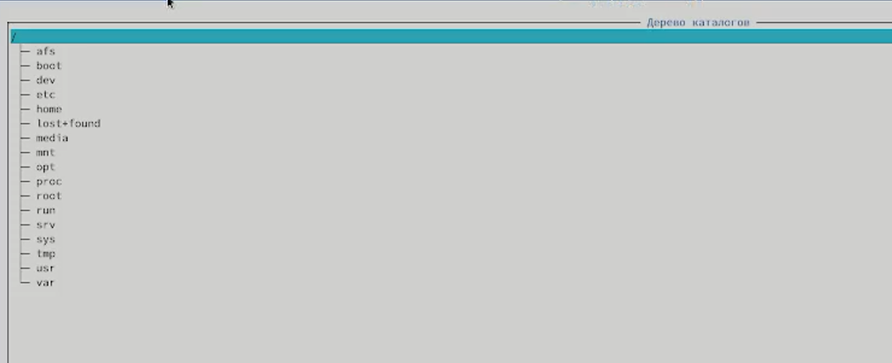{#fig:007 width=70%}
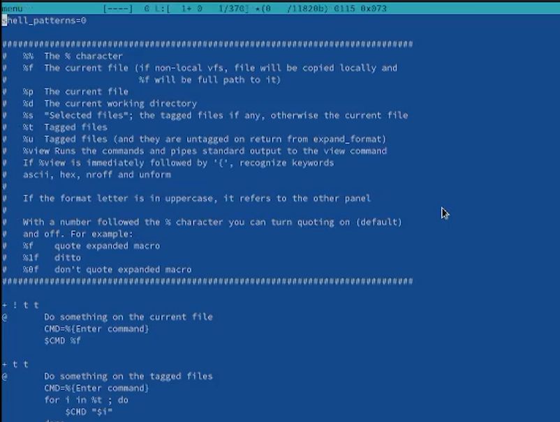{#fig:008 width=70%}
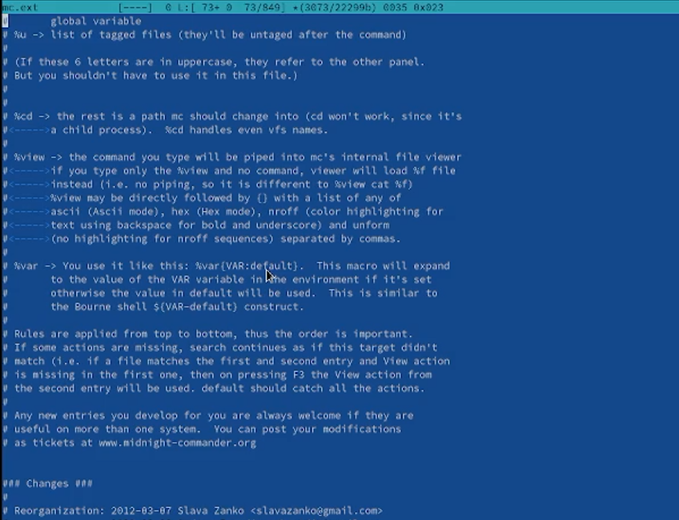{#fig:009 width=70%}

## 7. Вызвал подменю Настройки . Освоил операции, определяющие структуру экрана mc (Full screen, Double Width, Show Hidden Files и т.д.)
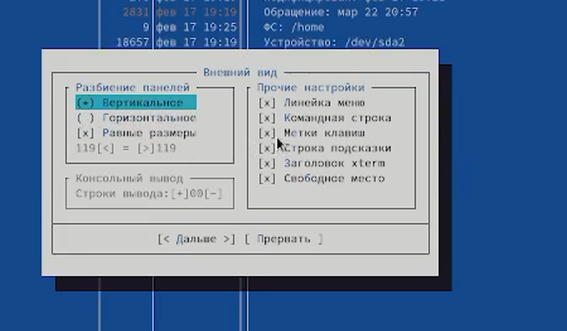{#fig:010 width=70%}
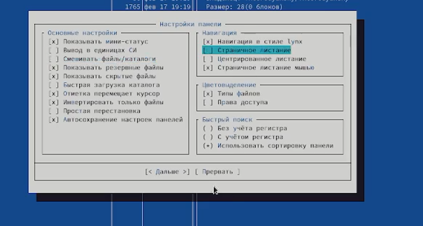{#fig:011 width=70%}

## 1. (1-4) Cоздайте текстовой файл text.txt. Откройте этот файл с помощью встроенного в mc редактора. Вставьте в открытый файл небольшой фрагмент текста, скопированный из любого другого файла или Интернета. Проделайте с текстом следующие манипуляции, используя горячие клавиши: -Удалите строку текста. -Выделите фрагмент текста и скопируйте его на новую строку. -Выделите фрагмент текста и перенесите его на новую строку. -Сохраните файл. -Отмените последнее действие. -Перейдите в конец файла (нажав комбинацию клавиш) и напишите некоторый текст. -Перейдите в начало файла (нажав комбинацию клавиш) и напишите некоторый текст. -Сохраните и закройте файл
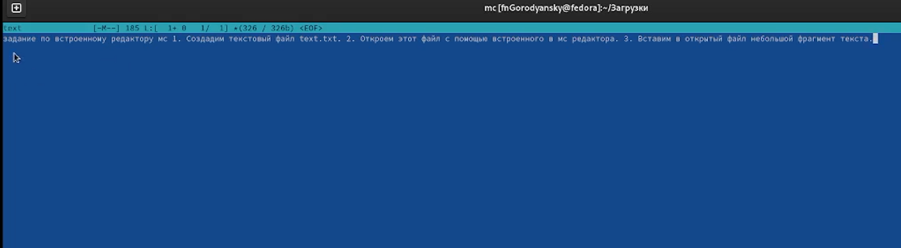{#fig:001 width=70%}
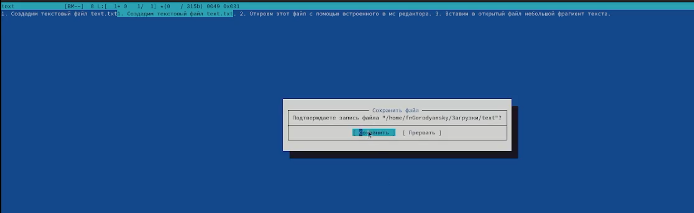{#fig:002 width=70%}

## 2. Откройте файл с исходным текстом на некотором языке программирования (например C или Java).
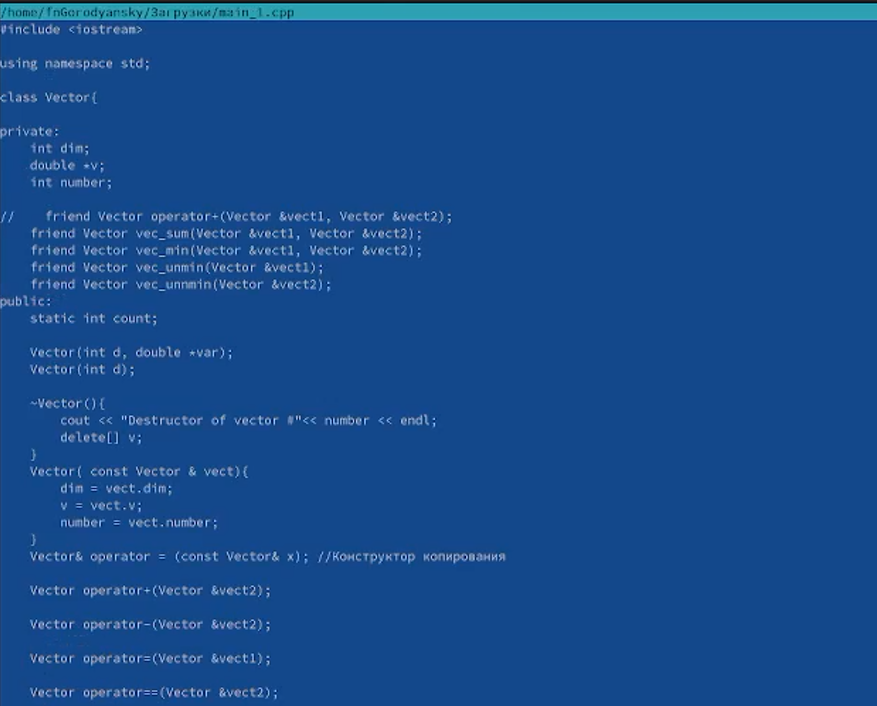{#fig:003 width=70%}

## 3. Используя меню редактора, включите подсветку синтаксиса, если она не включена, или выключите, если она включена.
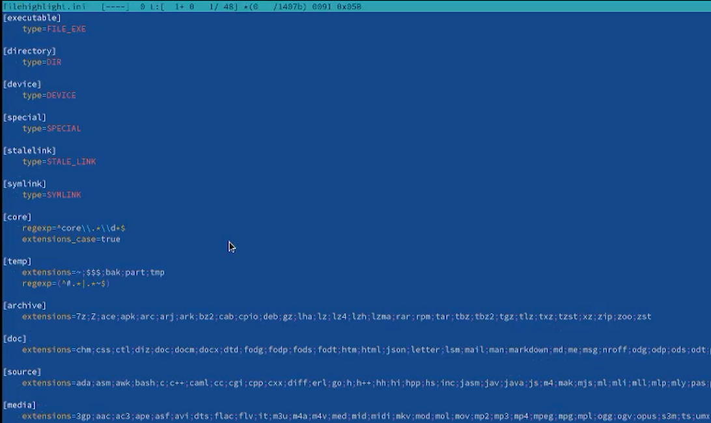{#fig:004 width=70%}

## Вывод

Получил опыт при работе с командной оболочкой mc.

