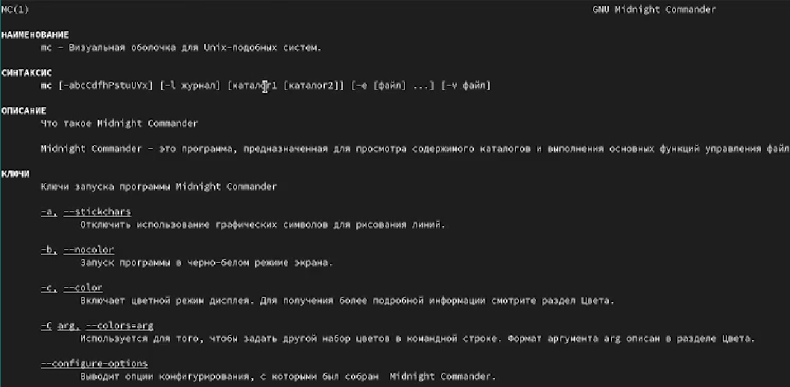
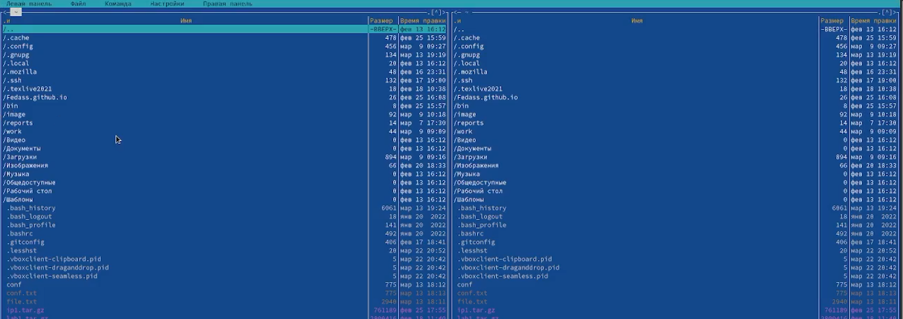
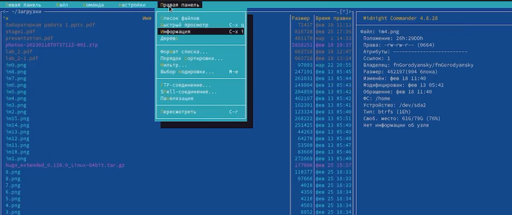
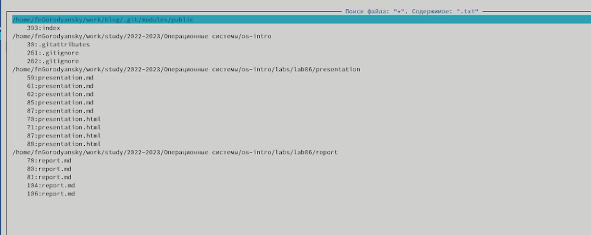
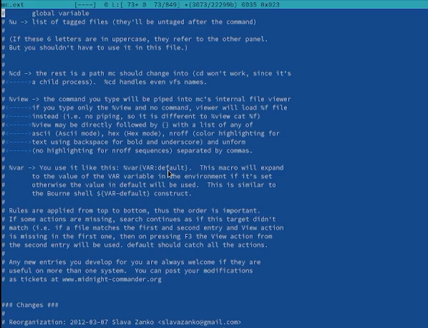
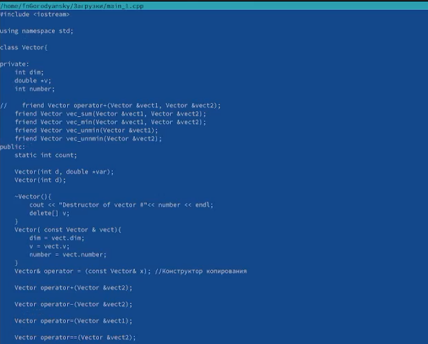

---
## Front matter
title: "Отчёт по лабораторной работе №7"
subtitle: "Командная оболочка Midnight Commander"
author: "Городянский Фёдор Николаевич"

## Generic otions
lang: ru-RU
toc-title: "Содержание"

## Bibliography
bibliography: bib/cite.bib
csl: pandoc/csl/gost-r-7-0-5-2008-numeric.csl

## Pdf output format
toc: true # Table of contents
toc-depth: 2
lof: true # List of figures
lot: true # List of tables
fontsize: 12pt
linestretch: 1.5
papersize: a4
documentclass: scrreprt
## I18n polyglossia
polyglossia-lang:
  name: russian
  options:
	- spelling=modern
	- babelshorthands=true
polyglossia-otherlangs:
  name: english
## I18n babel
babel-lang: russian
babel-otherlangs: english
## Fonts
mainfont: PT Serif
romanfont: PT Serif
sansfont: PT Sans
monofont: PT Mono
mainfontoptions: Ligatures=TeX
romanfontoptions: Ligatures=TeX
sansfontoptions: Ligatures=TeX,Scale=MatchLowercase
monofontoptions: Scale=MatchLowercase,Scale=0.9
## Biblatex
biblatex: true
biblio-style: "gost-numeric"
biblatexoptions:
  - parentracker=true
  - backend=biber
  - hyperref=auto
  - language=auto
  - autolang=other*
  - citestyle=gost-numeric
## Pandoc-crossref LaTeX customization
figureTitle: "Рис."
tableTitle: "Таблица"
listingTitle: "Листинг"
lofTitle: "Список иллюстраций"
lotTitle: "Список таблиц"
lolTitle: "Листинги"
## Misc options
indent: true
header-includes:
  - \usepackage{indentfirst}
  - \usepackage{float} # keep figures where there are in the text
  - \floatplacement{figure}{H} # keep figures where there are in the text
---

# Цель работы

Освоение основных возможностей командной оболочки Midnight Commander. Приоб-
ретение навыков практической работы по просмотру каталогов и файлов; манипуляций
с ними.

# Задание

Задание по mc
1. Изучите информацию о mc, вызвав в командной строке man mc.
2. Запустите из командной строки mc, изучите его структуру и меню.
3. Выполните несколько операций в mc, используя управляющие клавиши (операции
с панелями; выделение/отмена выделения файлов, копирование/перемещение фай-
лов, получение информации о размере и правах доступа на файлы и/или каталоги
и т.п.)
4. Выполните основные команды меню левой (или правой) панели. Оцените степень
подробности вывода информации о файлах.
5. Используя возможности подменю Файл , выполните:
– просмотр содержимого текстового файла;
– редактирование содержимого текстового файла (без сохранения результатов
редактирования);
– создание каталога;
– копирование в файлов в созданный каталог.
6. С помощью соответствующих средств подменю Команда осуществите:
– поиск в файловой системе файла с заданными условиями (например, файла
с расширением .c или .cpp, содержащего строку main);
– выбор и повторение одной из предыдущих команд;
– переход в домашний каталог;
– анализ файла меню и файла расширений.
7. Вызовите подменю Настройки . Освойте операции, определяющие структуру экрана mc
(Full screen, Double Width, Show Hidden Files и т.д.)

Задание по встроенному редактору mc
1. Создайте текстовой файл text.txt.
2. Откройте этот файл с помощью встроенного в mc редактора.
3. Вставьте в открытый файл небольшой фрагмент текста, скопированный из любого
другого файла или Интернета.
4. Проделайте с текстом следующие манипуляции, используя горячие клавиши:
4.1. Удалите строку текста.
4.2. Выделите фрагмент текста и скопируйте его на новую строку.
Кулябов Д. С. и др. Операционные системы 69
4.3. Выделите фрагмент текста и перенесите его на новую строку.
4.4. Сохраните файл.
4.5. Отмените последнее действие.
4.6. Перейдите в конец файла (нажав комбинацию клавиш) и напишите некоторый
текст.
4.7. Перейдите в начало файла (нажав комбинацию клавиш) и напишите некоторый
текст.
4.8. Сохраните и закройте файл.
5. Откройте файл с исходным текстом на некотором языке программирования (напри-
мер C или Java)
6. Используя меню редактора, включите подсветку синтаксиса, если она не включена,
или выключите, если она включенa.

# Выполнение лабораторной работы
## Задание по mc
1. Изучил информацию о mc, вызвав в командной строке man mc.
{#fig:001 width=70%}
2. Запустил из командной строки mc, изучил его структуру и меню.
{#fig:002 width=70%}
3. Выполнил несколько операций в mc, используя управляющие клавиши (операции
с панелями; выделение/отмена выделения файлов, копирование/перемещение фай-
лов, получение информации о размере и правах доступа на файлы и/или каталоги
и т.п.).
{#fig:003 width=70%}
4. Выполнил основные команды меню левой (или правой) панели. 
{#fig:004 width=70%}
5. Используя возможности подменю Файл , выполнил:
– просмотр содержимого текстового файла;
– редактирование содержимого текстового файла (без сохранения результатов
редактирования);
– создание каталога;
– копирование в файлов в созданный каталог.
{#fig:005 width=70%}
6. С помощью соответствующих средств подменю Команда осуществил:
– поиск в файловой системе файла с заданными условиями (например, файла
с расширением .c или .cpp, содержащего строку main);
– выбор и повторение одной из предыдущих команд;
– переход в домашний каталог;
– анализ файла меню и файла расширений.

{#fig:006 width=70%}
{#fig:007 width=70%}
{#fig:008 width=70%}
{#fig:009 width=70%}
7. Вызвал подменю Настройки . Освоил операции, определяющие структуру экрана mc
(Full screen, Double Width, Show Hidden Files и т.д.)
{#fig:010 width=70%}
{#fig:011 width=70%}

## Задание по встроенному редактору mc
1. (1-4) Cоздайте текстовой файл text.txt. Откройте этот файл с помощью встроенного в mc редактора. Вставьте в открытый файл небольшой фрагмент текста, скопированный из любого другого файла или Интернета.
Проделайте с текстом следующие манипуляции, используя горячие клавиши:
-Удалите строку текста.
-Выделите фрагмент текста и скопируйте его на новую строку.
-Выделите фрагмент текста и перенесите его на новую строку.
-Сохраните файл.
-Отмените последнее действие.
-Перейдите в конец файла (нажав комбинацию клавиш) и напишите некоторый
текст.
-Перейдите в начало файла (нажав комбинацию клавиш) и напишите некоторый
текст.
-Сохраните и закройте файл
{#fig:001 width=70%}
{#fig:002 width=70%}
2. Откройте файл с исходным текстом на некотором языке программирования (например C или Java).
{#fig:003 width=70%}
3. Используя меню редактора, включите подсветку синтаксиса, если она не включена, или выключите, если она включена.
{#fig:004 width=70%}

# Выводы

Получил опыт при работе с командной оболочкой mc.
