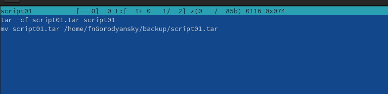

---
## Front matter
lang: ru-RU
title: Лабораторная работа №10
subtitle: Программирование в командном процессоре ОС Линукс. Командные файлы
author:
  - Городянский Ф.Н.
institute:
  - Российский университет дружбы народов, Москва, Россия
date: 15 апреля 2023

## i18n babel
babel-lang: russian
babel-otherlangs: english

## Formatting pdf
toc: false
toc-title: Содержание
slide_level: 2
aspectratio: 169
section-titles: true
theme: metropolis
header-includes:
 - \metroset{progressbar=frametitle,sectionpage=progressbar,numbering=fraction}
 - '\makeatletter'
 - '\beamer@ignorenonframefalse'
 - '\makeatother'
---

# Информация

## Докладчик

:::::::::::::: {.columns align=center}
::: {.column width="70%"}

  * Городянский Фёдор Николаевич
  * студент фФМиЕН
  * Российский университет дружбы народов
  * <https://github.com/Fedass>

:::
::: {.column width="30%"}

# Элементы презентации

## Цель

Изучить основы программирования в оболочке ОС UNIX/Linux. Научиться писать
небольшие командные файлы.

## Задачи

1. Написать скрипт, который при запуске будет делать резервную копию самого себя (то
есть файла, в котором содержится его исходный код) в другую директорию backup
в вашем домашнем каталоге. При этом файл должен архивироваться одним из ар-
хиваторов на выбор zip, bzip2 или tar. Способ использования команд архивации
необходимо узнать, изучив справку.
2. Написать пример командного файла, обрабатывающего любое произвольное число
аргументов командной строки, в том числе превышающее десять. Например, скрипт
может последовательно распечатывать значения всех переданных аргументов.
3. Написать командный файл — аналог команды ls (без использования самой этой ко-
манды и команды dir). Требуется, чтобы он выдавал информацию о нужном каталоге
и выводил информацию о возможностях доступа к файлам этого каталога.
4. Написать командный файл, который получает в качестве аргумента командной строки
формат файла (.txt, .doc, .jpg, .pdf и т.д.) и вычисляет количество таких файлов
в указанной директории. Путь к директории также передаётся в виде аргумента ко-
мандной строки.

## 1. Написать скрипт, который при запуске будет делать резервную копию самого себя (то есть файла, в котором содержится его исходный код) в другую директорию backup в вашем домашнем каталоге. При этом файл должен архивироваться одним из архиваторов на выбор zip, bzip2 или tar. Способ использования команд архивации необходимо узнать, изучив справку.

{#fig:001 width=50%}
{#fig:002 width=50%}
{#fig:003 width=50%}

## 2. Написать пример командного файла, обрабатывающего любое произвольное число аргументов командной строки, в том числе превышающее десять. Например, скрипт может последовательно распечатывать значения всех переданных аргументов.

{#fig:004 width=50%}
{#fig:005 width=50%}

## 3. Написать командный файл — аналог команды ls (без использования самой этой команды и команды dir). Требуется, чтобы он выдавал информацию о нужном каталоге и выводил информацию о возможностях доступа к файлам этого каталога.

{#fig:006 width=70%}
{#fig:007 width=70%}

## 4. Написать командный файл, который получает в качестве аргумента командной строки формат файла (.txt, .doc, .jpg, .pdf и т.д.) и вычисляет количество таких файлов в указанной директории. Путь к директории также передаётся в виде аргумента командной строки.

{#fig:008 width=70%}
{#fig:009 width=70%}

## Результаты

Получил навыки программирования в командной оболочке ОС UNIX/Linux.
