---
## Front matter
lang: ru-RU
title: 1 этап итогового проекта
subtitle: Создание сайта
author:
  - Городянский Ф.Н.
institute:
  - Российский университет дружбы народов, Москва, Россия
date: 25 февраля 2023

## i18n babel
babel-lang: russian
babel-otherlangs: english

## Formatting pdf
toc: false
toc-title: Содержание
slide_level: 2
aspectratio: 169
section-titles: true
theme: metropolis
header-includes:
 - \metroset{progressbar=frametitle,sectionpage=progressbar,numbering=fraction}
 - '\makeatletter'
 - '\beamer@ignorenonframefalse'
 - '\makeatother'
---

# Информация

## Докладчик

:::::::::::::: {.columns align=center}
::: {.column width="70%"}

  * Городянский Фёдор Николаевич
  * студент фФМиЕН
  * Российский университет дружбы народов
  * <https://github.com/Fedass>

:::
::: {.column width="30%"}

:::
::::::::::::::

# Вводная часть


## Цели и задачи

- Создать сайт.

## Материалы и методы

- Процессор `pandoc` для входного формата Markdown
- Результирующие форматы
	- `pdf`
	- `html`
- Автоматизация процесса создания: `Makefile`

# Создание презентации

## Процессор `pandoc`

- Pandoc: преобразователь текстовых файлов
- Сайт: <https://pandoc.org/>
- Репозиторий: <https://github.com/jgm/pandoc>

## Формат `pdf`

- Использование LaTeX
- Пакет для презентации: [beamer](https://ctan.org/pkg/beamer)
- Тема оформления: `metropolis`

## Код для формата `pdf`

```yaml
slide_level: 2
aspectratio: 169
section-titles: true
theme: metropolis
```

## Формат `html`

- Используется фреймворк [reveal.js](https://revealjs.com/)
- Используется [тема](https://revealjs.com/themes/) `beige`

## Код для формата `html`

- Тема задаётся в файле `Makefile`

```make
REVEALJS_THEME = beige 
```
# Результаты

## Получающиеся форматы

- Полученный `pdf`-файл можно демонстрировать в любой программе просмотра `pdf`
- Полученный `html`-файл содержит в себе все ресурсы: изображения, css, скрипты

# Выполнение работы


1. Скачал файл hugo, перенес в папку bin.
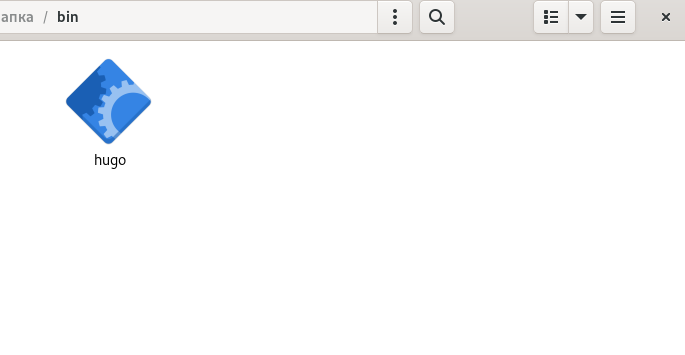{#fig:001 width=70%}
2. Копировал репозиторий проекта.
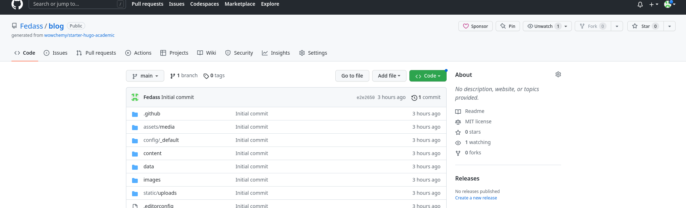{#fig:002 width=70%}
3. Клонировал данные в репозиторий.
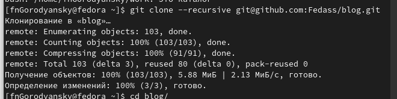{#fig:003 width=70%}
4. Запустил файл hugo в рабочем каталоге.
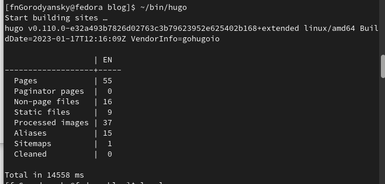{#fig:004 width=70%}
5. Вывел содержимое.
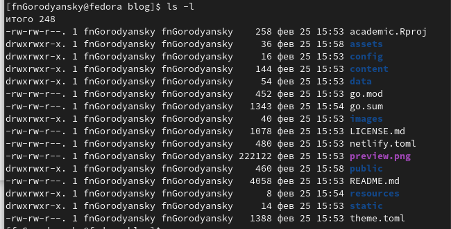{#fig:005 width=70%}
6. Выполнил команду hugo server.
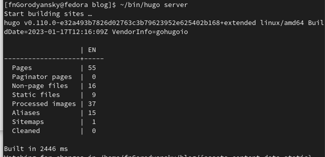{#fig:006 width=70%}
7. Создал репозиторий для сайта, перенес данные в предыдущий репозиторий.
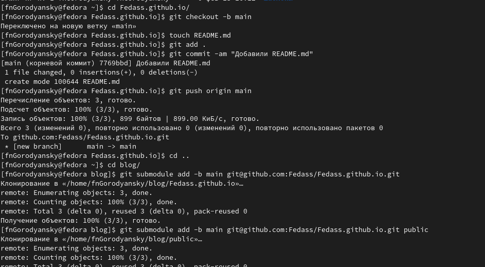{#fig:007 width=70%}
8. Закомментировал файл public, добавил его в blog.
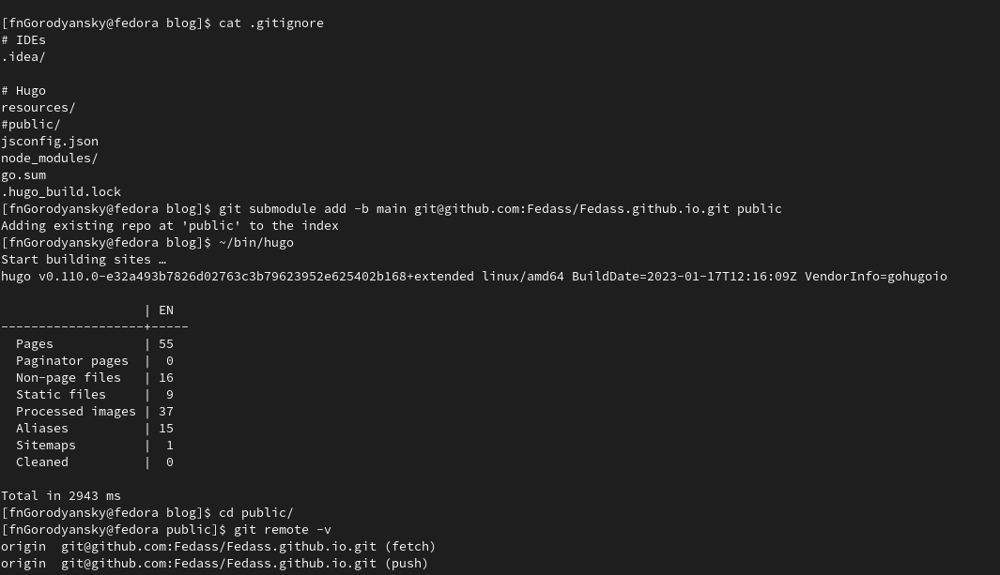{#fig:008 width=70%}
9. Загрузил данные на сервер.
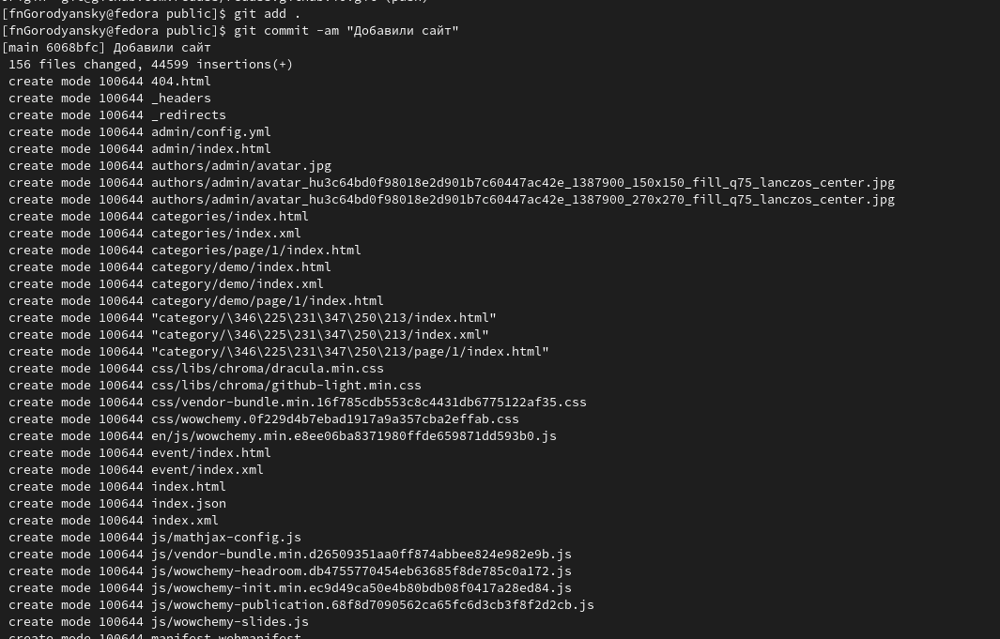{#fig:009 width=70%}
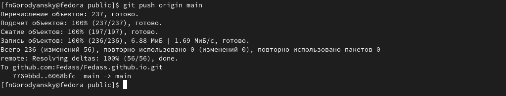{#fig:010 width=70%}
10. Репозиторий сайта.
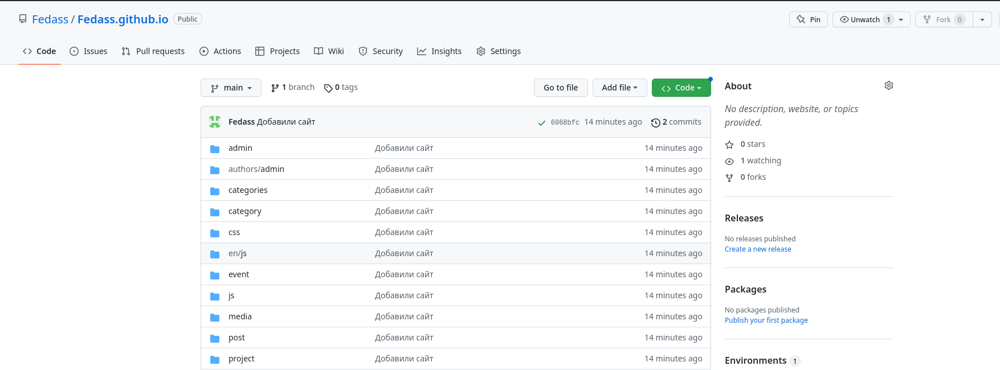{#fig:011 width=70%}
11. Сам сайт.
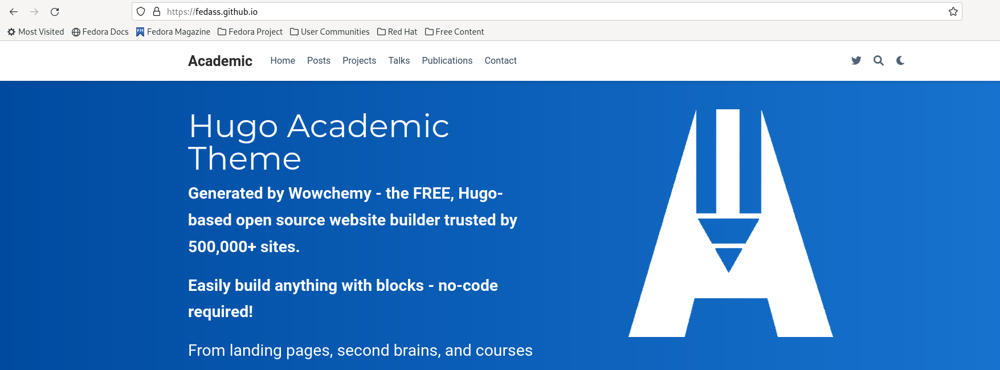{#fig:012 width=70%}


## Результаты

Выполнил первый этап проекта.


## Итоговый слайд

- Запоминается последняя фраза. © Штирлиц
- Главное сообщение, которое вы хотите донести до слушателей
- Избегайте использовать последний слайд вида *Спасибо за внимание*

# Рекомендации

## Принцип 10/20/30

  - 10 слайдов
  - 20 минут на доклад
  - 30 кегль шрифта

## Связь слайдов

::: incremental

- Один слайд --- одна мысль
- Нельзя ссылаться на объекты, находящиеся на предыдущих слайдах (например, на формулы)
- Каждый слайд должен иметь заголовок

:::

## Количество сущностей

::: incremental

- Человек может одновременно помнить $7 \pm 2$ элемента
- При размещении информации на слайде старайтесь чтобы в сумме слайд содержал не более 5 элементов
- Можно группировать элементы так, чтобы визуально было не более 5 групп

:::

## Общие рекомендации

::: incremental

- На слайд выносится та информация, которая без зрительной опоры воспринимается хуже
- Слайды должны дополнять или обобщать содержание выступления или его частей, а не дублировать его
- Информация на слайдах должна быть изложена кратко, чётко и хорошо структурирована
- Слайд не должен быть перегружен графическими изображениями и текстом
- Не злоупотребляйте анимацией и переходами

:::

## Представление данных

::: incremental

- Лучше представить в виде схемы
- Менее оптимально представить в виде рисунка, графика, таблицы
- Текст используется, если все предыдущие способы отображения информации не подошли

:::

