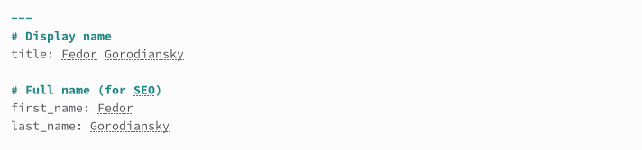
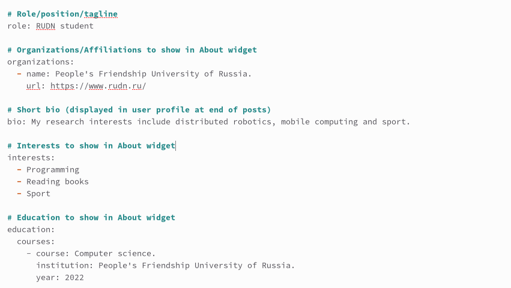
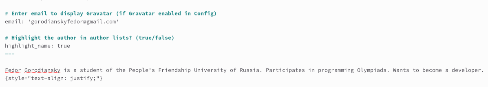
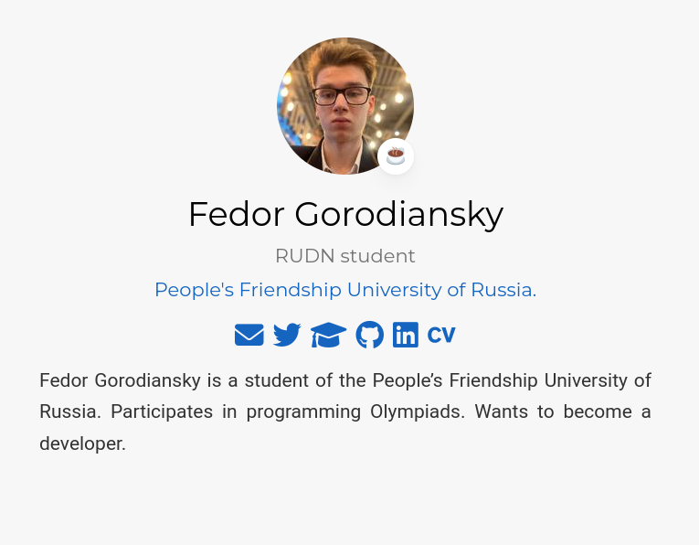
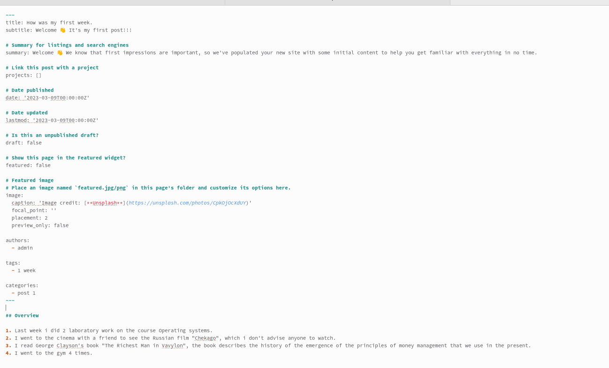
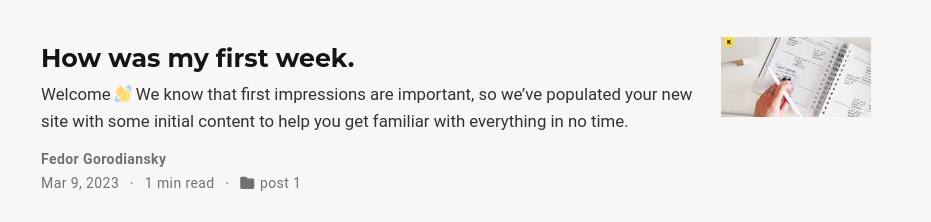
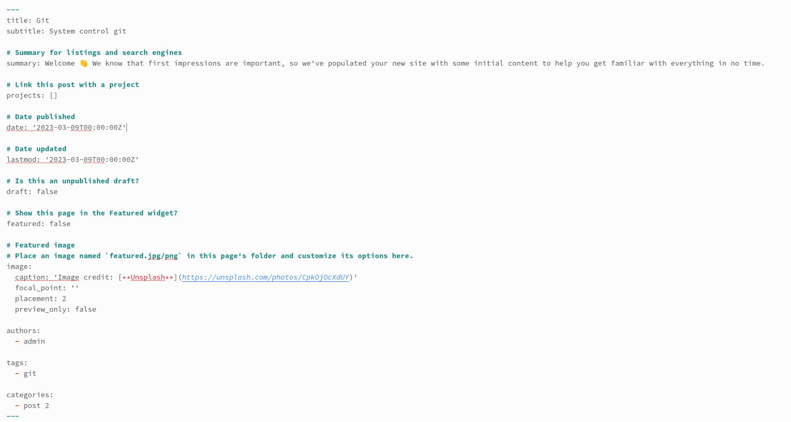
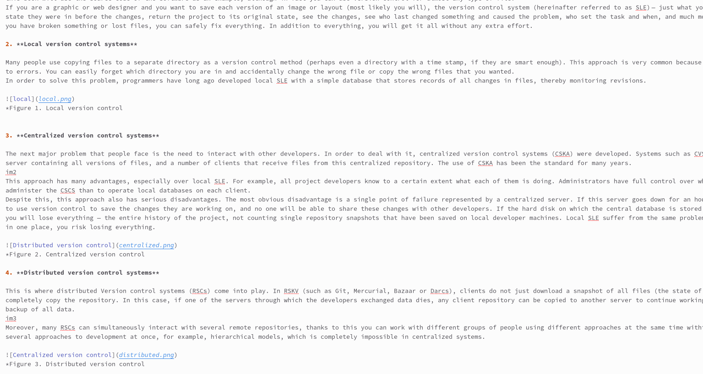
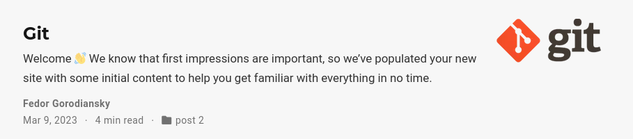

---
## Front matter
lang: ru-RU
title: Отчёт по 2 этапу индивидуального проекта. 
subtitle: Создание сайта
author:
  - Городянский Ф.Н.
institute:
  - Российский университет дружбы народов, Москва, Россия
date: 09 марта 2023

## i18n babel
babel-lang: russian
babel-otherlangs: english

## Formatting pdf
toc: false
toc-title: Содержание
slide_level: 2
aspectratio: 169
section-titles: true
theme: metropolis
header-includes:
 - \metroset{progressbar=frametitle,sectionpage=progressbar,numbering=fraction}
 - '\makeatletter'
 - '\beamer@ignorenonframefalse'
 - '\makeatother'
---

# Информация

## Докладчик

:::::::::::::: {.columns align=center}
::: {.column width="70%"}

  * Городянский Фёдор Николаевич
  * студент фФМиЕН.
  * Российский университет дружбы народов
  * <https://github.com/Fedass>

:::
::: {.column width="30%"}

:::
::::::::::::::

# Элементы презентации

## Цели и задачи

Цель: Изменение главной страницы и создание 2 постов.

1. Изменить главную страницу
2. Создать пост про первую неделю
3. Создать пост про гит.

## Содержание исследования

1. В content/post открыли файл index.md и изменили имя и фамилию.
{#fig:001 width=70%}
2. Поменяли данные об авторе.
{#fig:002 width=70%}
3. Написали личную информацию.
{#fig:003 width=70%}
{#fig:004 width=70%}
4. Открыли файл index.md в папке week1 и прописали информацию.
{#fig:005 width=70%}
{#fig:006 width=70%}
5. Открыли файл index.md в папке post2 и внесли изменения.
{#fig:007 width=70%}
{#fig:008 width=70%}
{#fig:009 width=70%}

## Результаты

Внес личную информацию на главную страницу и создал 2 поста.

