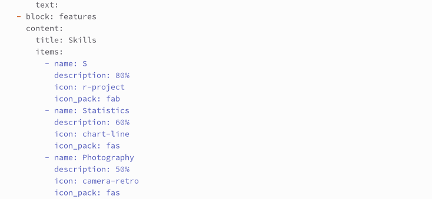
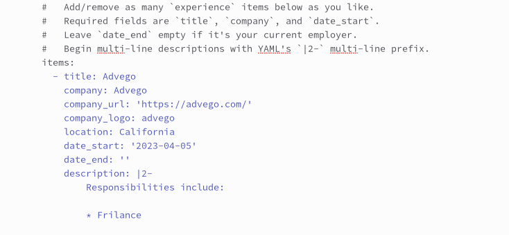
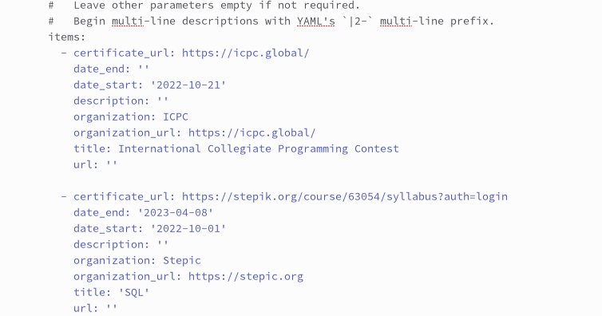
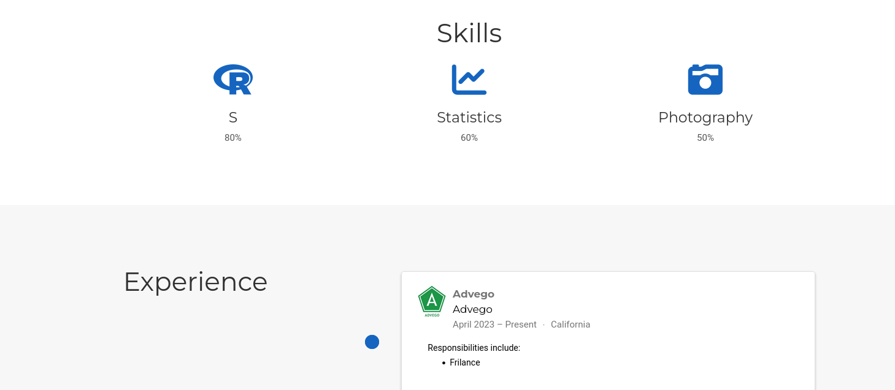
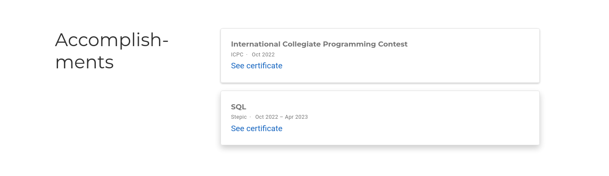
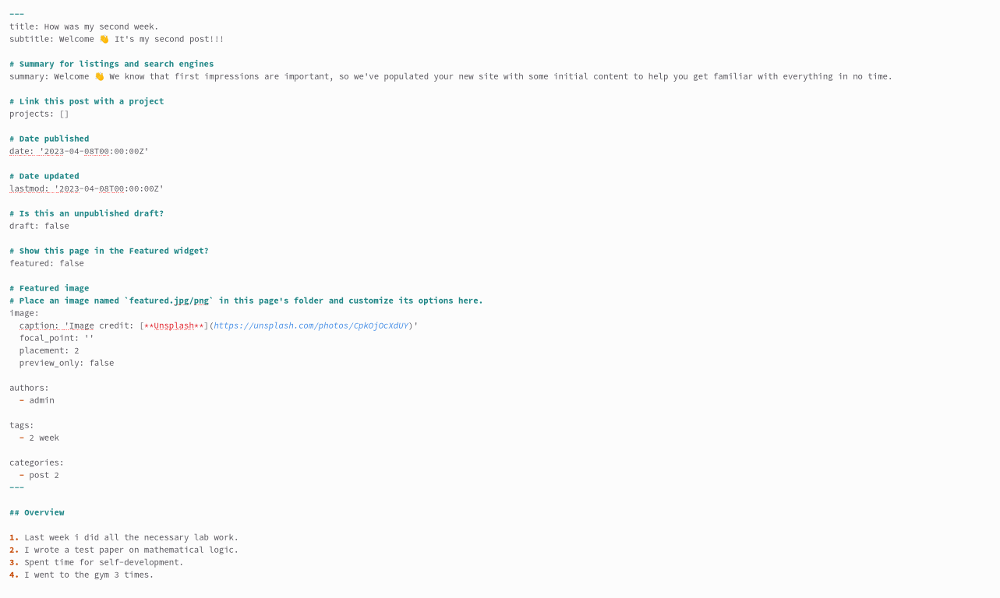
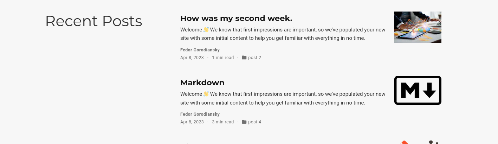
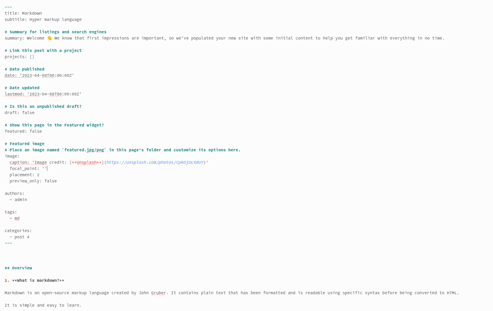
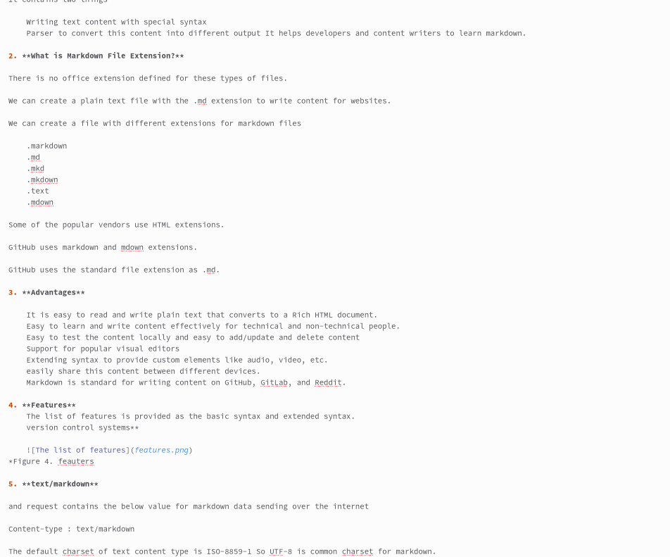

---
## Front matter
lang: ru-RU
title: 3 этап ип
subtitle: Создание сайта
author:
  - Городянский Ф.Н.
institute:
  - Российский университет дружбы народов, Москва, Россия
date: 08 апреля 2023

## i18n babel
babel-lang: russian
babel-otherlangs: english

## Formatting pdf
toc: false
toc-title: Содержание
slide_level: 2
aspectratio: 169
section-titles: true
theme: metropolis
header-includes:
 - \metroset{progressbar=frametitle,sectionpage=progressbar,numbering=fraction}
 - '\makeatletter'
 - '\beamer@ignorenonframefalse'
 - '\makeatother'
---

# Информация

## Докладчик

:::::::::::::: {.columns align=center}
::: {.column width="70%"}

  * Городянский Фёдор Николаевич
  * студент фФМиЕН.
  * Российский университет дружбы народов
  * <https://github.com/Fedass>

:::
::: {.column width="30%"}

:::
::::::::::::::

# Элементы презентации

## Цели и задачи

Изменение пунктов skills, expirience, accomplish­ments.
Создание постов про предыдущую неделю и про язык гиперразметки markdown.

## Выполнение работы. 1. Изменил информацию в skills.

{#fig:001 width=70%}

## 2. Изменил информацию в expirience.

{#fig:002 width=70%}

## 3. Изменил информацию в accomplishments.

{#fig:003 width=70%}

## 4. Отображение этих пунктов на странице сайта.

{#fig:004 width=50%}
{#fig:005 width=50%}

## 5. Написал пост в md про прошлую неделю

{#fig:006 width=60%}

## 6. Отображение постов на сайте.

{#fig:007 width=70%}

## 7. Написал пост в md про язык гиперразметки markdown.

{#fig:007 width=60%}

{#fig:008 width=60%}

## Результаты

Изменил на сайте ифнормацию про свои навыки и достижения и залил 2 поста.

