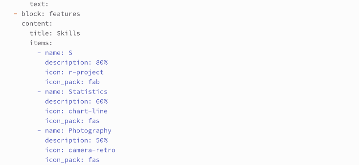
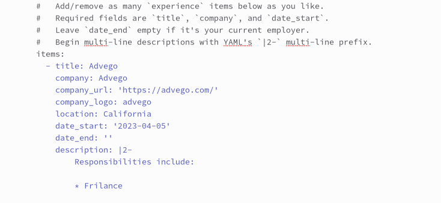
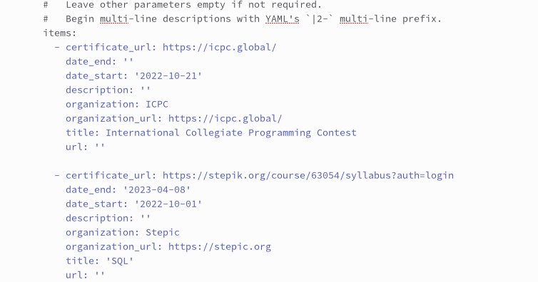
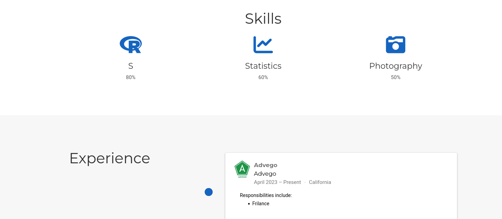
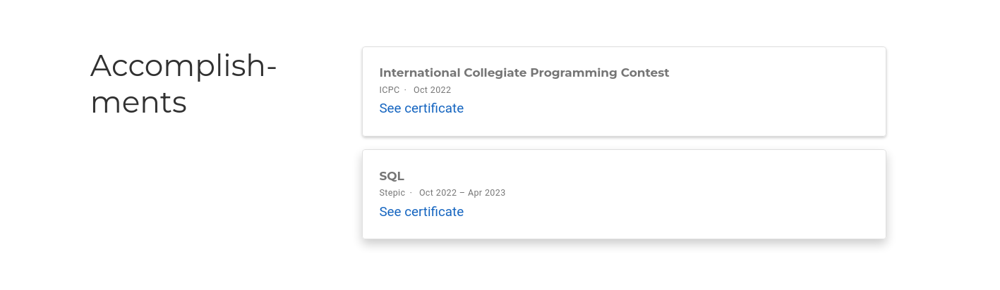
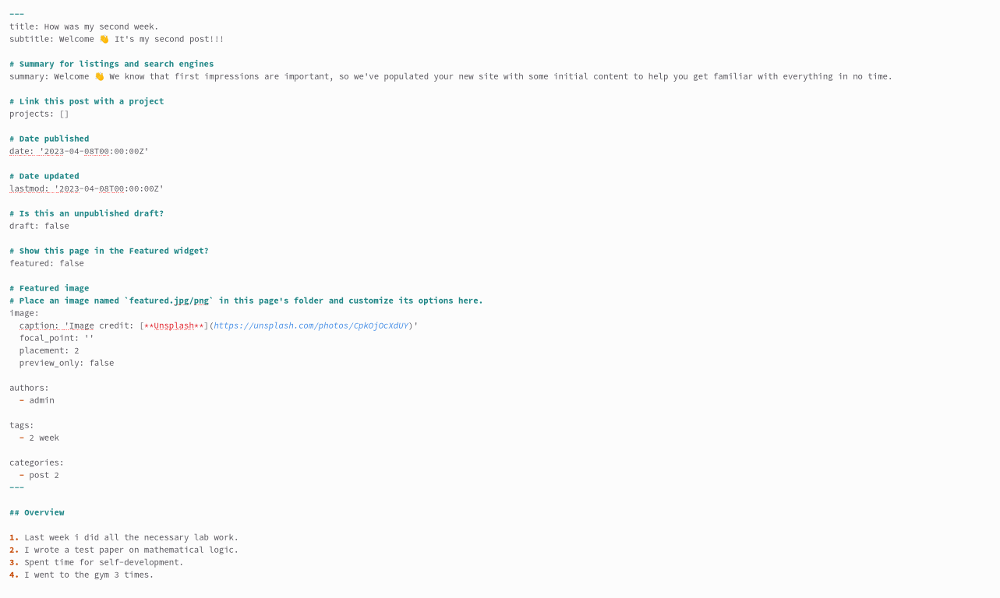
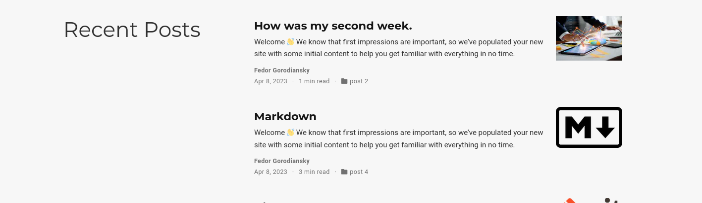
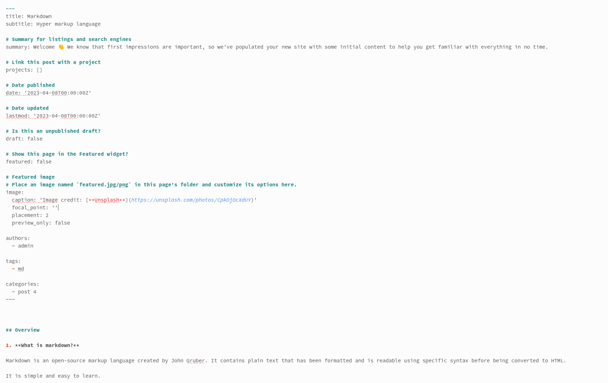
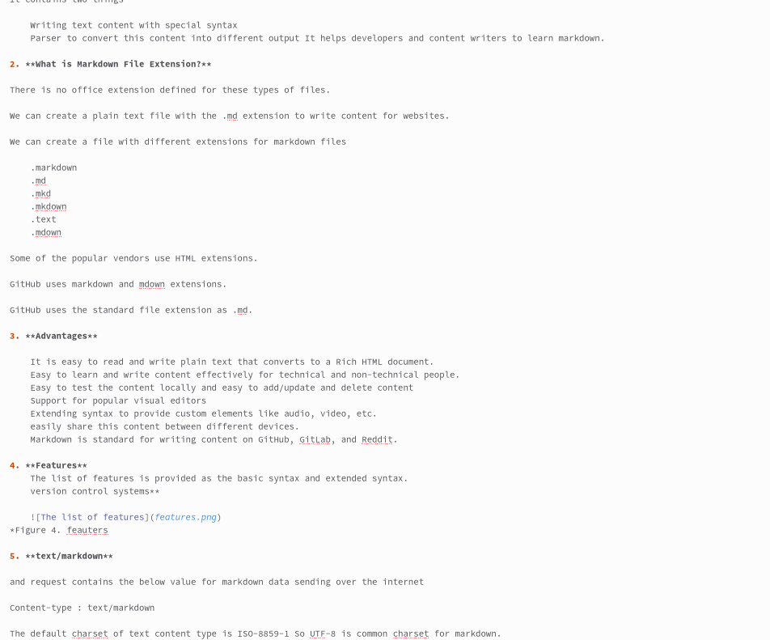

---
## Front matter
title: "3 этап ип"
subtitle: "Создание сайта"
author: "Городянский Фёдор Николаевич"

## Generic otions
lang: ru-RU
toc-title: "Содержание"

## Bibliography
bibliography: bib/cite.bib
csl: pandoc/csl/gost-r-7-0-5-2008-numeric.csl

## Pdf output format
toc: true # Table of contents
toc-depth: 2
lof: true # List of figures
lot: true # List of tables
fontsize: 12pt
linestretch: 1.5
papersize: a4
documentclass: scrreprt
## I18n polyglossia
polyglossia-lang:
  name: russian
  options:
	- spelling=modern
	- babelshorthands=true
polyglossia-otherlangs:
  name: english
## I18n babel
babel-lang: russian
babel-otherlangs: english
## Fonts
mainfont: PT Serif
romanfont: PT Serif
sansfont: PT Sans
monofont: PT Mono
mainfontoptions: Ligatures=TeX
romanfontoptions: Ligatures=TeX
sansfontoptions: Ligatures=TeX,Scale=MatchLowercase
monofontoptions: Scale=MatchLowercase,Scale=0.9
## Biblatex
biblatex: true
biblio-style: "gost-numeric"
biblatexoptions:
  - parentracker=true
  - backend=biber
  - hyperref=auto
  - language=auto
  - autolang=other*
  - citestyle=gost-numeric
## Pandoc-crossref LaTeX customization
figureTitle: "Рис."
tableTitle: "Таблица"
listingTitle: "Листинг"
lofTitle: "Список иллюстраций"
lotTitle: "Список таблиц"
lolTitle: "Листинги"
## Misc options
indent: true
header-includes:
  - \usepackage{indentfirst}
  - \usepackage{float} # keep figures where there are in the text
  - \floatplacement{figure}{H} # keep figures where there are in the text
---

# Цель работы

Изменение пунктов skills, expirience, accomplish­ments.
Создание постов про предыдущую неделю и про язык гиперразметки markdown.

# Задание

Написать skills, expirience, accomplish­ments. 
Написать посты про предыдущую неделю и про язык гиперразметки markdown.

# Выполнение лабораторной работы

1. Изменил информацию в skills.
{#fig:001 width=70%}
2. Изменил информацию в expirience.
{#fig:002 width=70%}
3. Изменил информацию в accomplishments.
{#fig:003 width=70%}
4. Отображение этих пунктов на странице сайта.
{#fig:004 width=50%}
{#fig:005 width=50%}
5. Написал пост в md про прошлую неделю
{#fig:006 width=60%}
6. Отображение постов на сайте.
{#fig:007 width=70%}
7. Написал пост в md про язык гиперразметки markdown.
{#fig:007 width=60%}
{#fig:008 width=60%}

# Выводы

Изменил на сайте ифнормацию про свои навыки и достижения и залил 2 поста.

