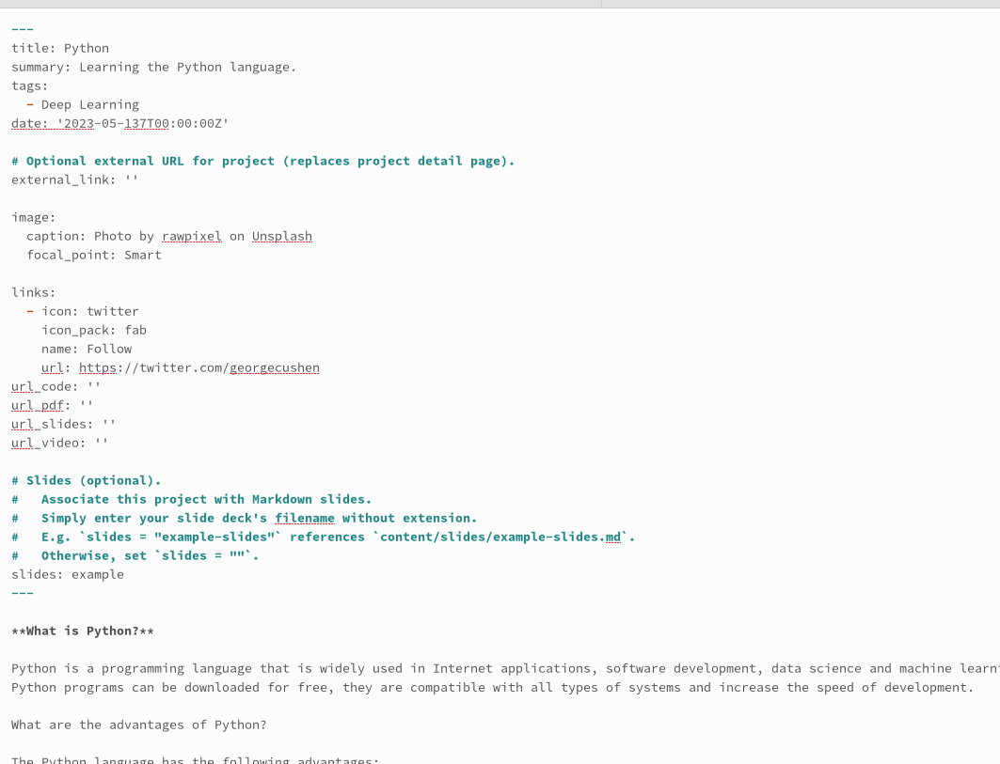
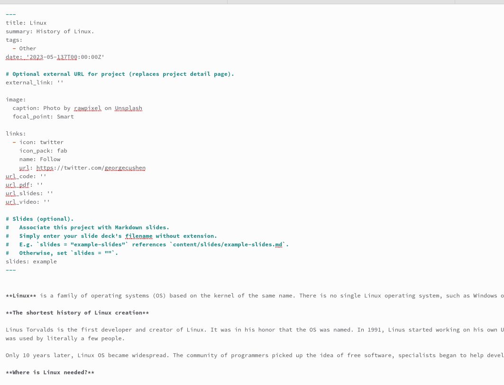
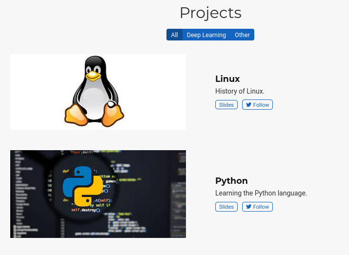
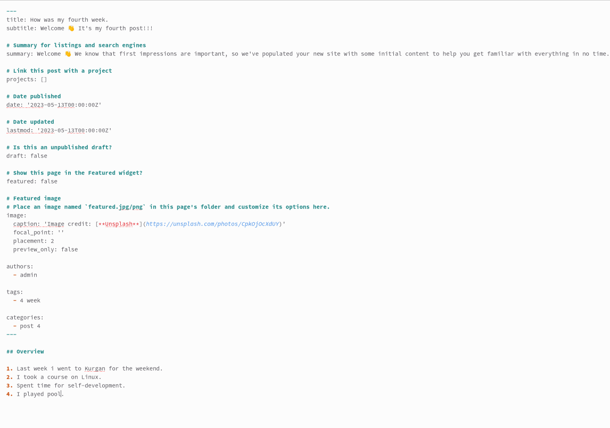
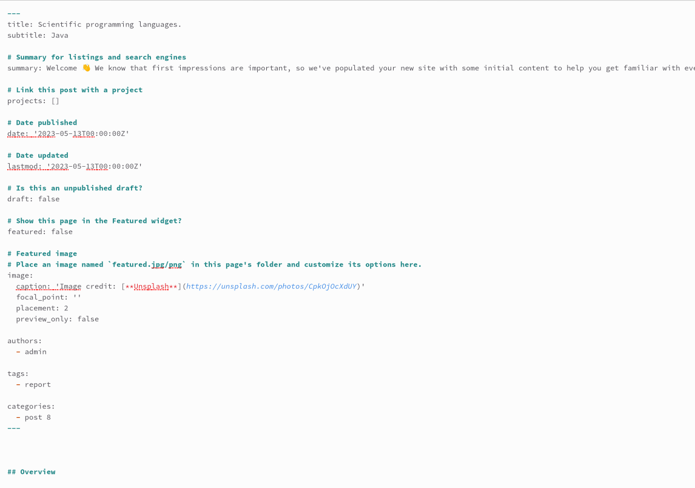
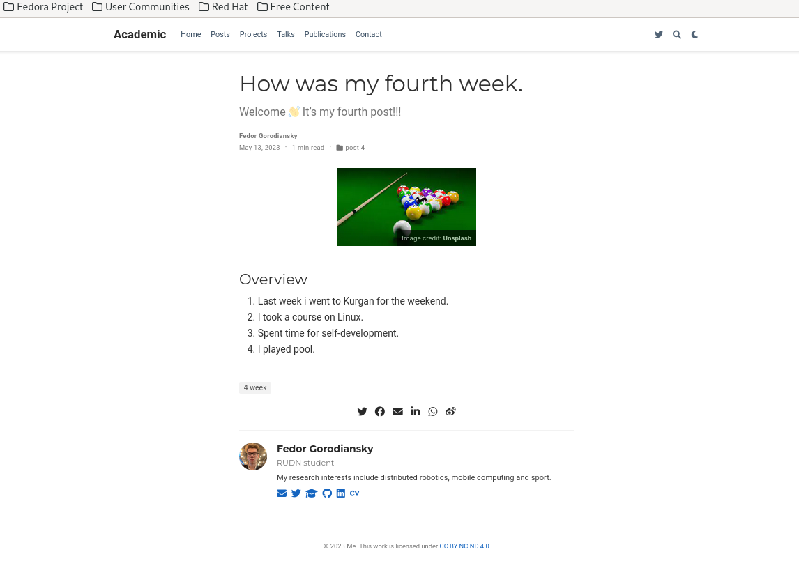
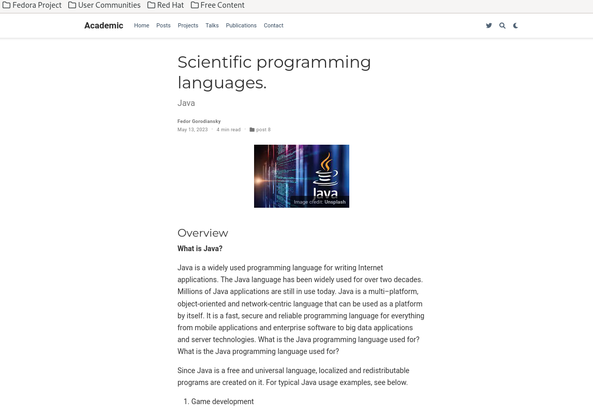

---
## Front matter
lang: ru-RU
title: Отчет по 5 этапу ип.
subtitle: Создание сайта
author:
  - Городянский Ф.Н.
institute:
  - Российский университет дружбы народов, Москва, Россия
 
date: 13 мая 2023

## i18n babel
babel-lang: russian
babel-otherlangs: english

## Formatting pdf
toc: false
toc-title: Содержание
slide_level: 2
aspectratio: 169
section-titles: true
theme: metropolis
header-includes:
 - \metroset{progressbar=frametitle,sectionpage=progressbar,numbering=fraction}
 - '\makeatletter'
 - '\beamer@ignorenonframefalse'
 - '\makeatother'
---

# Информация

## Докладчик

:::::::::::::: {.columns align=center}
::: {.column width="70%"}

  * Городянский Фёдор Николаевич
  * студент фФМиЕН.
  * Российский университет дружбы народов
  * <https://yamadharma.github.io/ru/>

:::
::::::::::::::

# Элементы презентации

## Цели и задачи

Сделать записи для персонального проекта. Написать посты про предыдущую неделю и языки научного прогаммирования.

## 1. Написал пост про язык программирования Python.

{#fig:001 width=70%}

## 2. Написал пост про систему Линукс.

{#fig:002 width=70%}

## 3. Посты в разделе Projects.

{#fig:003 width=70%}

## 4. Создал пост про предыдущую неделю.

{#fig:004 width=70%}

## 5. Создал пост про язык научного программирования Java.

{#fig:005 width=70%}

## 6. Пост про предыдущую неделю.

{#fig:006 width=70%} 

## 7. Пост про java.

{#fig:007 width=70%}

## Результаты

Создал 4 поста.

